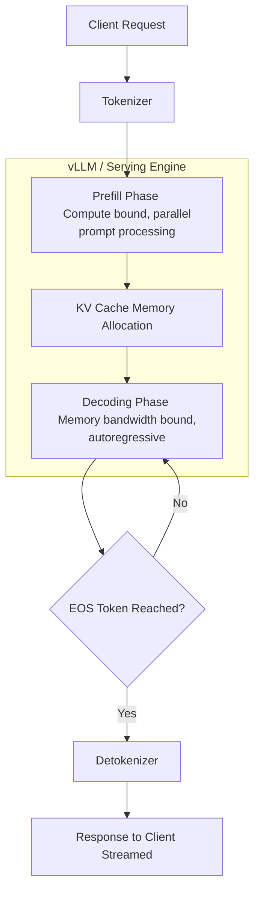
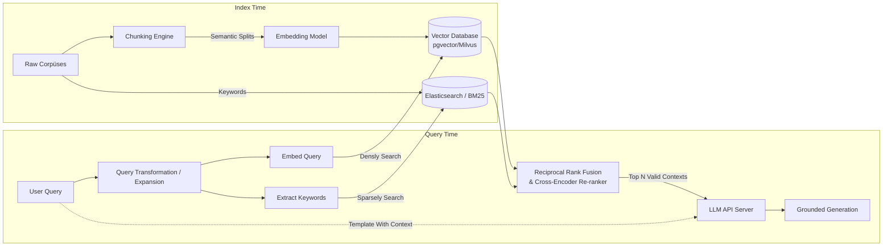
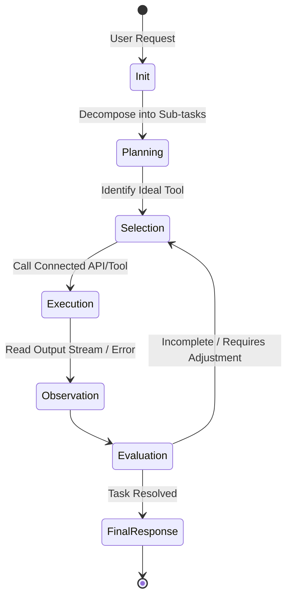
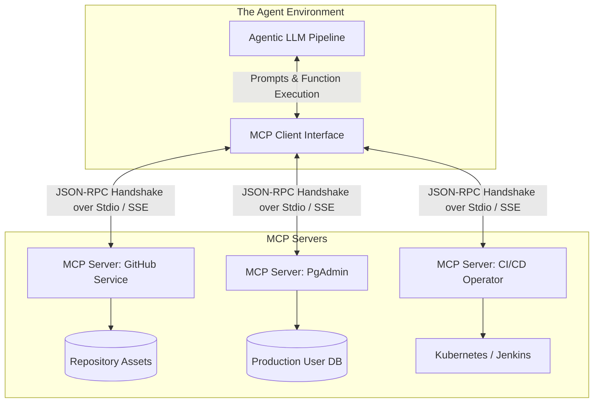

# Staff Engineer's Guide to the Modern AI Ecosystem

This document provides a deep, architectural dive into Large Language Models (LLMs), Retrieval-Augmented Generation (RAG), Agentic AI, and the Model Context Protocol (MCP). It is structured for Staff-level engineers, focusing on system architecture, data flow, scaling considerations, and practical implementations.

## 1. Large Language Models (LLMs)

### Conceptual Deep Dive
LLMs are foundational models based on the Transformer architecture. For system design, the most critical aspects are how they handle sequences (tokens), their memory constraints (context window), and the compute bounds of generating output (autoregressive decoding). 

Key architectural concepts:
- **Tokenization:** Text is mapped to integer IDs using algorithms like Byte-Pair Encoding (BPE). Vocabulary sizes are typically 32k-128k.
- **KV Cache:** During text generation, self-attention requires previous key-value pairs. Caching this per-request state in GPU VRAM is the primary memory bottleneck in LLM inference.
- **Inference Architectures:** Serving LLMs at scale requires techniques like Continuous Batching (processing requests of different lengths simultaneously) and Pipeline/Tensor Parallelism (splitting large model layers across multiple GPUs).

### Visual: LLM Inference Lifecycle



### Code Example: Efficient LLM Inference Setup (Conceptual Python)
```python
# Utilizing vLLM for high-throughput serving
from vllm import LLM, SamplingParams

# Initializes the model with PagedAttention (optimizes KV cache vRAM management)
llm = LLM(model="meta-llama/Llama-3-8B-Instruct", tensor_parallel_size=2)
sampling_params = SamplingParams(temperature=0.7, top_p=0.95, max_tokens=1024)

def generate_response(prompts: list[str]) -> list[str]:
    # Continuous batching handles variable context lengths efficiently under the hood
    outputs = llm.generate(prompts, sampling_params)
    return [output.outputs[0].text for output in outputs]
```

---

## 2. Retrieval-Augmented Generation (RAG)

### Conceptual Deep Dive
LLMs possess a static knowledge cutoff and frequently hallucinate. RAG solves this by injecting dynamic, retrieved context into the context window. At scale, RAG is less of an AI problem and fundamentally a **Search & Information Retrieval** problem coupled with a generative summarization pipeline.

Advanced RAG strategies:
- **Semantic Chunking:** Splitting documents logically (by formatting, headers, boundaries) rather than by strict arbitrary character counts prevents breaking contextual flow.
- **Hybrid Search:** Combining dense vector-space search (semantic search, e.g., matching "fast vehicle" with "car") with sparse keyword search (BM25 or TF-IDF, good for strict exact queries like "UUID-1234").
- **Two-Stage Retrieval (Re-ranking):** Fetching the top 100 results with a low-latency retriever (e.g., Pinecone/Milvus), then scoring them rigorously with an expensive Cross-Encoder model to feed the precise top 5 to the LLM.

### Visual: Enterprise RAG Pipeline



### Code Example: Hybrid Search Representation (Go)
```go
package rag

import (
	"context"
	"fmt"
)

// Retriever interface abstracts underlying Vector DBs and Document stores.
type Retriever interface {
	Search(ctx context.Context, query string, topK int) ([]Document, error)
}

type DeliveryRAG struct {
	VectorStore Retriever
	KeywordDB   Retriever
	ReRanker    ReRankClient
	LLM         LLMClient
}

// Execute applies the Hybrid Search -> Rerank -> Generation pattern
func (r *DeliveryRAG) Execute(ctx context.Context, query string) (string, error) {
    // 1. Parallel Independent Retrieval
    vecData, _ := r.VectorStore.Search(ctx, query, 50)
    keywordData, _ := r.KeywordDB.Search(ctx, query, 50)
    
    // 2. Fusion and Cross-Encoder Scoring
    combined := mergeAndDeduplicateDocs(vecData, keywordData)
    topContexts, _ := r.ReRanker.Rank(ctx, query, combined, 5) // Prune down to Top 5
    
    // 3. Grounded Prompt Formulation
    promptContext := buildSystemPrompt(query, topContexts)
    
    // 4. Autoregressive Generation
    return r.LLM.Generate(ctx, promptContext)
}
```

---

## 3. Agentic AI

### Conceptual Deep Dive
Agentic AI architectures shift models from passive input-output functions to active autonomous executors. An Agent can reason about its instructions, observe the environment via Tools, and decide the optimal subsequent actions sequentially until a goal state is met.

Core Control Loop Components:
- **Decision Engine (LLM):** Usually implemented via ReAct (Reason + Act) prompting technique or native function calling API capabilities.
- **Tooling Interface:** Functions exposed to the agent (e.g., standard POSIX operations, REST API wrappers, SQL connectors).
- **State/Memory:** Short-term state is actively maintained in the prompt history, while long-term state might page out to an external Database or RAG index.
- **Evaluator:** Mechanisms validating if sub-tasks satisfy constraints before moving forward.

### Visual: Agent Execution Loop



### Code Example: Minimal Agent Controller Loop
```python
def run_agent(task_goal: str, available_tools: dict, max_iterations: int = 7):
    memory_chain = [{"role": "system", "content": f"Tools available: {available_tools.keys()}.\nGoal: {task_goal}"}]
    
    for attempt in range(max_iterations):
        # 1. Ask the Brain what to do next
        llm_response = call_llm(memory_chain) 
        
        # 2. Base Case Check
        if llm_response.is_final_answer():
            return llm_response.text
        
        # 3. Handle External Action Execution
        if llm_response.has_tool_call():
            tool_name = llm_response.tool_call.name
            kwargs = llm_response.tool_call.kwargs
            
            try:
                # E.g. execute_kubernetes_command(namespace='prod', command='logs')
                execution_result = available_tools[tool_name](**kwargs) 
                response_str = f"Tool SUCCESS: {execution_result}"
            except Exception as e:
                response_str = f"Tool FAILED: {str(e)}"
            
            # 4. Integrate Feedback
            memory_chain.append({"role": "assistant", "content": llm_response.text})
            memory_chain.append({"role": "tool_feedback", "content": response_str})

    raise TimeoutError("Agent could not converge to a final answer within iteration limit.")
```

---

## 4. Model Context Protocol (MCP)

### Conceptual Deep Dive
The Model Context Protocol is an open standard designed by Anthropic to construct a universal interface between AI Agents and diverse local/remote data environments. Rather than hardcoding tool and database integrations directly inside of the LLM pipeline wrappers, MCP externalizes them. 

MCP architecture represents a Client-Server paradigm:
- **MCP Client:** The AI Application (like Claude-Desktop, Cursor, or your custom Agent UI). It queries available schema and tools dynamically.
- **MCP Server:** A discrete service representing the data resource (e.g., an internal GitHub App MCP server, a Postgres connection MCP server). 
- **The Payoff:** Sandboxed execution schemas, simplified secrets management, and re-usable toolkits across different AI agents. Engineers write the backend MCP resource endpoints, and the AI agent automatically infers how to use them.

### Visual: Model Context Architecture Paradigm



### Code Example: Building a Basic Python MCP Tool Server
```python
# Utilizing the FastMCP SDK wrapper
from mcp.server.fastmcp import FastMCP

# This server can run securely inside standard infrastructure
mcp = FastMCP("InfrastructureOperations")

# Expose static, read-only resources as context
@mcp.resource("internal://architecture/diagram")
def get_architecture_specs() -> str:
    return fetch_from_confluence("ARCH-1092")

# Expose executable commands using `@mcp.tool()`
# The typing and docstring automatically configure the JSON Schema the LLM sees.
@mcp.tool()
def rollback_deployment(service_name: str, target_checksum: str) -> str:
    """Restores a given microservice to a historical state based on checksum."""
    print(f"Triggering rollback for {service_name} to {target_checksum}...")
    # Business Logic executed securely in back-end
    return execute_argocd_sync(service_name, target_checksum)

if __name__ == "__main__":
    # Server bootstraps over Standard I/O, meaning the Client Process spawns this
    mcp.run()
```

---

## 5. Staff Engineer's Learning Path & Execution Plan

To deploy these systems successfully, standard software engineering rigor must be applied to fuzzy logic systems. Proceed linearly through these phases:

### Phase 1: Bare Metal Foundations & De-Mystification (Weeks 1-2)
- **Action:** Install engines like `Ollama` and `vLLM` locally. Play with running smaller models (e.g., Qwen-2.5-7B, Llama-3-8B).
- **Study Topic:** Explore Model Quantization (GGUF, FP16 vs INT8). Learn how local inference changes latency curves based on Prompt length (Prefill time) vs Generation length (Decoding time).
- **Goal:** Understand the strict hardware bottlenecks. Avoid abstracting concepts away too early with SaaS APIs.

### Phase 2: RAG Engineering & Evaluations (Weeks 3-4)
- **Action:** Build a retrieval pipeline **without frameworks**. Utilize standard Python/Go REST clients interacting with a local `pgvector` container.
- **Study Topic:** Investigate **Evaluation Metrics** rather than "vibe checks". Integrate frameworks like **Ragas** (RAG Assessment) or **TruLens** to statistically measure Context Relevancy, Information Recall, and Groundedness against golden datasets.
- **Goal:** Shift from rudimentary semantic search to engineered Multi-stage Retrieval pipelines and hybrid reranking mechanisms.

### Phase 3: Architecting Agent Systems & Guardrails (Weeks 5-6)
- **Action:** Utilize the **Model Context Protocol** to write an MCP Server wrapping a core internal developer tool (e.g., Jira, Jenkins, Datadog). 
- **Study Topic:** Transition into building Agent frameworks (LangGraph, Semantic Kernel). Focus heavily on defining state machines where an AI's tool request is intercepted, evaluated syntactically, and placed in a sandboxed execution boundary.
- **Goal:** Realize that in enterprise architectures, building AI applications requires more time dedicated to Routing, Rate-Limiting, Data Masking, and Security Sandboxing than actual prompt engineering.

### Recommended Architectural Reading
- **vLLM / PagedAttention Paper:** For comprehension of memory fragmentation during token generation.
- **ReAct (Reasoning and Acting) Framework:** Foundational logic for planning algorithms.
- **GraphRAG Concepts (Microsoft):** Expanding RAG from vector geometry to entity relationship network graphs.
- **modelcontextprotocol.io:** Official Anthropic specification standards.
