# Swiggy Coupon Platform — Complete System Design

## End-to-End User Flow

```
User views cart → GET /coupons/eligible (fetch applicable coupons)
→ User selects coupon → POST /coupons/apply (validate + reserve)
→ User pays → POST /coupons/redeem (atomic redemption)
→ Payment fails? → POST /coupons/invalidate (rollback)
```

---

# Part 1: High-Level Design (HLD)

## 1.1 Microservice Boundaries

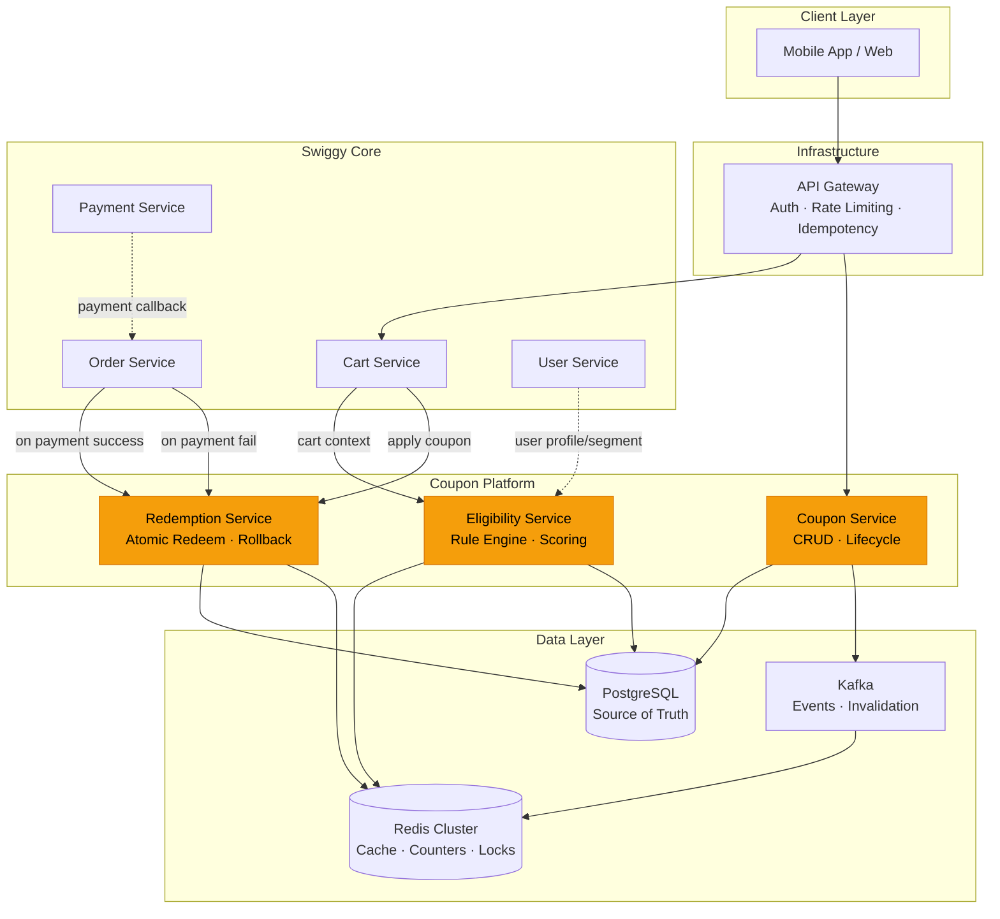

### Service Responsibilities

| Service | Owns | Responsibilities |
|---|---|---|
| **Coupon Service** | `coupon`, `coupon_rules` tables | Create/update/delete coupons, manage lifecycle (DRAFT→ACTIVE→EXPIRED), admin APIs |
| **Eligibility Service** | Read-only access + Redis cache | Evaluate rules against cart context, rank by priority/discount, return best coupons |
| **Redemption Service** | `user_coupon`, `coupon_redemption_log` tables | Atomic redeem with optimistic locking, rollback on payment failure, usage counter management |
| **Payment Service** | (External) | Sends payment success/failure callback → triggers redeem or invalidate |

### Cache Layer (Redis)

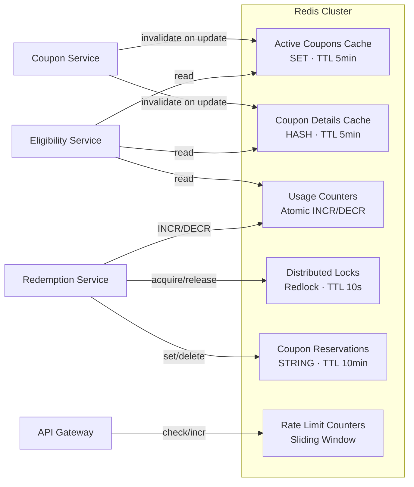

**Key Patterns:**
```
coupon:active                     → SET {coupon_id_1, coupon_id_2, ...}
coupon:detail:{coupon_id}         → HASH {all coupon fields + rules}
coupon:usage:{coupon_id}:global   → INT (atomic counter)
coupon:usage:{coupon_id}:u:{uid}  → INT (per-user counter, TTL 24h)
coupon:reserve:{coupon_id}:u:{uid}→ STRING "1" (TTL 10min)
coupon:lock:{coupon_id}           → Redlock (TTL 10s)
ratelimit:apply:{user_id}        → Sliding window counter
```

### Rate Limiting

| Endpoint | Limit | Window | Purpose |
|---|---|---|---|
| `GET /coupons/eligible` | 30 req | per minute per user | Prevent scraping coupon catalog |
| `POST /coupons/apply` | 10 req | per minute per user | Prevent brute-forcing codes |
| `POST /coupons/redeem` | 5 req | per minute per user | Prevent redemption spam |

Implementation: **Sliding window** counter in Redis at API Gateway level.

---

## 1.2 Payment Service Integration

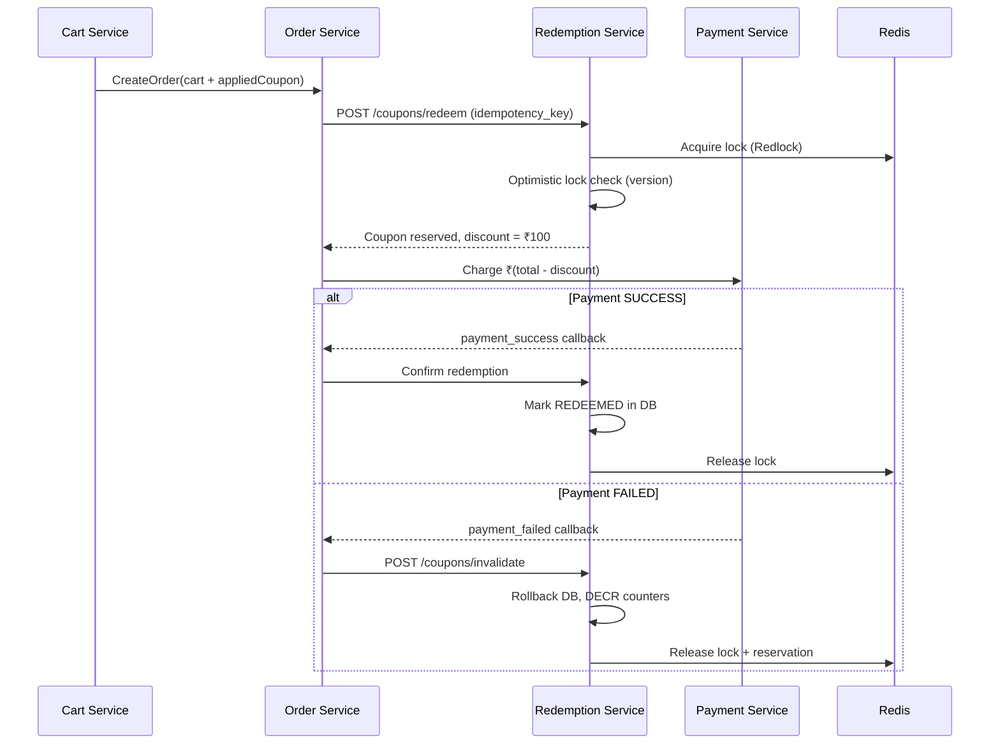

---

## 1.3 CartContext → Eligibility Engine → Result (Complete Lifecycle)

This section explains **exactly when** the CartContext is built, **who sends it** to the Eligibility Engine, **what happens inside** step by step, and **when the result arrives** back to the user.

### When Does CartContext Go to the Eligibility Engine?

There are **5 trigger points** in the user journey where CartContext is sent to the Eligibility Engine. Each trigger has a different urgency and purpose:

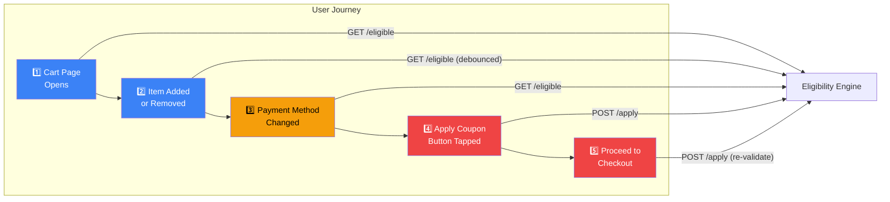

| # | Trigger | API Called | Why? | Urgency |
|---|---|---|---|---|
| 1️⃣ | **User opens cart page** | `GET /eligible` | Show available coupons in carousel | Medium — user is browsing |
| 2️⃣ | **Item added/removed** | `GET /eligible` (debounced 500ms) | Cart value changed → some coupons may now qualify or disqualify | Low — debounced to avoid spam |
| 3️⃣ | **Payment method changed** | `GET /eligible` | Bank offers depend on payment method — HDFC coupon should appear only when HDFC card selected | Medium — affects visible coupons |
| 4️⃣ | **User taps "Apply Coupon"** | `POST /apply` | Hard validation — lock the coupon for this session | **High** — user expects instant feedback |
| 5️⃣ | **User taps "Proceed to Pay"** | `POST /apply` (re-validate) | Final check before money moves — cart or coupon state may have changed since Step 4 | **Critical** — must be correct |

### Who Constructs the CartContext?

The **Cart Service** constructs the CartContext by aggregating data from multiple services:

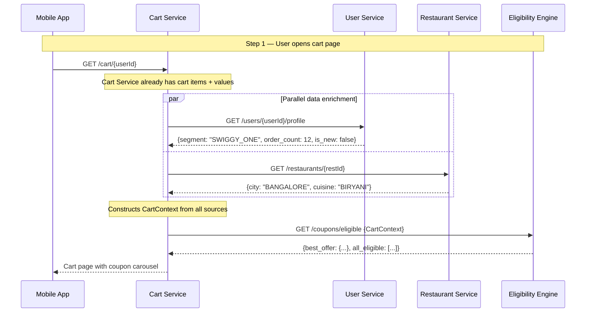

```go
// Cart Service — builds CartContext before calling Eligibility Engine

func (s *CartService) GetCartWithCoupons(ctx context.Context, userID uuid.UUID) (*CartResponse, error) {
    // ── Step 1: Get the cart (already owned by Cart Service) ──
    cart, err := s.repo.GetCart(ctx, userID)
    if err != nil {
        return nil, err
    }

    // ── Step 2: Enrich with user profile (parallel call) ──
    var userProfile *UserProfile
    var restaurant *Restaurant
    var enrichErr error

    g, gCtx := errgroup.WithContext(ctx)

    g.Go(func() error {
        profile, err := s.userClient.GetProfile(gCtx, userID)
        if err != nil {
            return err
        }
        userProfile = profile
        return nil
    })

    g.Go(func() error {
        rest, err := s.restaurantClient.Get(gCtx, cart.RestaurantID)
        if err != nil {
            return err
        }
        restaurant = rest
        return nil
    })

    if enrichErr = g.Wait(); enrichErr != nil {
        // Graceful degradation — proceed without enrichment
        // Some coupons may not match, but core flow works
        log.Warnf("enrichment failed: %v", enrichErr)
    }

    // ── Step 3: Build CartContext ──
    cartCtx := CartContext{
        UserID:         userID,
        CartValue:      cart.TotalValue(),
        Items:          toCartItems(cart.Items),
        RestaurantID:   cart.RestaurantID,
        City:           restaurant.City,        // from Restaurant Service
        Cuisine:        restaurant.Cuisine,
        PaymentMethod:  cart.SelectedPayment,   // user's current selection
        Platform:       cart.Platform,           // ANDROID_APP, IOS_APP, WEB
        UserSegment:    userProfile.Segment,     // PREMIUM, SWIGGY_ONE, REGULAR
        UserOrderCount: userProfile.OrderCount,
        IsNewUser:      userProfile.OrderCount == 0,
    }

    // ── Step 4: Call Eligibility Engine ──
    eligible, err := s.eligibilityClient.GetEligible(ctx, cartCtx)
    if err != nil {
        // Fail gracefully — return cart without coupons
        log.Warnf("eligibility engine failed: %v", err)
        return &CartResponse{Cart: cart, Coupons: nil}, nil
    }

    return &CartResponse{
        Cart:      cart,
        Coupons:   eligible.AllEligible,
        BestOffer: eligible.BestOffer,
    }, nil
}
```

### What Happens Inside the Eligibility Engine? (Step by Step)

When the Eligibility Engine receives the CartContext, here's **exactly what happens** in what order, with timings:

```mermaid
flowchart TD
    START["CartContext arrives<br>⏱️ T=0ms"] --> S1

    subgraph "Phase 1: Data Loading (0-5ms)"
        S1["1. Check Redis for active coupons<br>coupon:active → SET of IDs<br>⏱️ ~1ms"] --> S1a{Cache hit?}
        S1a -->|"Yes"| S2["2. Bulk fetch coupon details from Redis<br>MGET coupon:detail:{id1}, {id2}...<br>⏱️ ~2ms"]
        S1a -->|"No (cache miss)"| S1b["2b. Query PostgreSQL<br>SELECT * FROM coupon WHERE status='ACTIVE'<br>AND now() BETWEEN start_time AND end_time<br>⏱️ ~15ms"]
        S1b --> S1c["Populate Redis cache<br>for next request"]
        S1c --> S3
        S2 --> S3
    end

    subgraph "Phase 2: Filtering (5-15ms)"
        S3["3. For each coupon, run filter chain<br>9 filters in sequence, fail-fast"]
        S3 --> F1["Filter 1: Time validity<br>is now between start_time & end_time?"]
        F1 --> F2["Filter 2: Min cart value<br>cartValue >= minCartValue?"]
        F2 --> F3["Filter 3: City match<br>user city in allowed cities?"]
        F3 --> F4["Filter 4: Restaurant match<br>restaurant in allowed list?"]
        F4 --> F5["Filter 5: Cuisine match"]
        F5 --> F6["Filter 6: Payment method<br>selected payment in allowed methods?"]
        F6 --> F7["Filter 7: User segment<br>SWIGGY_ONE, PREMIUM, etc."]
        F7 --> F8["Filter 8: Order count<br>first order? Nth order?"]
        F8 --> F9["Filter 9: Usage limit check<br>Redis GET per-user & global counters"]
    end

    subgraph "Phase 3: Scoring (15-20ms)"
        S4["4. Calculate discount for each surviving coupon<br>Apply FLAT/PERCENTAGE/CASHBACK formula"]
        S4 --> S5["5. Compute multi-factor score<br>MonetaryValue × Relevance × BusinessPriority"]
    end

    subgraph "Phase 4: Ranking & Response (20-25ms)"
        S6["6. Sort by score DESC<br>Tie-break by raw discount"]
        S6 --> S7["7. Take top 10"]
        S7 --> S8["8. Build response<br>best_offer + all_eligible"]
    end

    F9 --> S4
    S5 --> S6
    S8 --> DONE["Response sent<br>⏱️ T=25ms"]

    style START fill:#3b82f6,color:#fff
    style DONE fill:#22c55e,color:#fff
```

```go
// Eligibility Engine — complete internal processing

func (e *EligibilityEngine) GetApplicableOffers(ctx context.Context, cart CartContext) (*EligibilityResponse, error) {
    startTime := time.Now()

    // ════════════════════════════════════════════════════════════
    // Phase 1: DATA LOADING (~1-5ms with cache, ~15ms without)
    // ════════════════════════════════════════════════════════════
    
    offers, err := e.loadActiveOffers(ctx)
    if err != nil {
        return nil, fmt.Errorf("failed to load offers: %w", err)
    }
    
    log.Debugf("Phase 1 complete: loaded %d offers in %v", len(offers), time.Since(startTime))

    // ════════════════════════════════════════════════════════════
    // Phase 2: FILTERING (~5-10ms)
    // Run 9 filters in sequence. Order matters — cheapest checks first.
    // ════════════════════════════════════════════════════════════

    now := time.Now()
    var candidates []Coupon

    for _, offer := range offers {
        // Filter 1: Time validity (O(1), no I/O)
        if !offer.IsActive(now) {
            continue
        }

        // Filter 2: Min cart value (O(1), no I/O)
        if cart.CartValue < offer.MinCartValue {
            continue
        }

        // Filter 3-8: Constraint rules (O(n) where n = rules for this coupon)
        if !e.evaluateConstraints(offer.Rules, cart) {
            continue
        }

        // Filter 9: Usage limits (Redis I/O — most expensive filter, runs LAST)
        if !e.checkUsageLimits(ctx, offer, cart.UserID) {
            continue
        }

        candidates = append(candidates, offer)
    }
    
    log.Debugf("Phase 2 complete: %d/%d offers passed filters in %v", 
        len(candidates), len(offers), time.Since(startTime))

    // ════════════════════════════════════════════════════════════
    // Phase 3: SCORING (~2-5ms)
    // Calculate actual discount and multi-factor score
    // ════════════════════════════════════════════════════════════

    results := make([]EligibilityResult, 0, len(candidates))
    for _, offer := range candidates {
        discount := e.calculateDiscount(offer, cart.CartValue)
        score := e.scoreOffer(offer, cart, discount)

        results = append(results, EligibilityResult{
            CouponID:           offer.ID,
            Code:               offer.Code,
            Title:              offer.Title,
            DiscountType:       offer.DiscountType,
            CalculatedDiscount: discount,
            PriorityType:       offer.PriorityType,
            Score:              score,
            IsEligible:         true,
        })
    }

    // ════════════════════════════════════════════════════════════
    // Phase 4: RANKING & RESPONSE (~1ms)
    // Sort by score, take top 10, build response
    // ════════════════════════════════════════════════════════════

    sort.Slice(results, func(i, j int) bool {
        if results[i].Score == results[j].Score {
            return results[i].CalculatedDiscount > results[j].CalculatedDiscount
        }
        return results[i].Score > results[j].Score
    })

    // Cap at 10 results
    if len(results) > 10 {
        results = results[:10]
    }

    // Build response
    var bestOffer *EligibilityResult
    if len(results) > 0 {
        bestOffer = &results[0]
    }

    totalTime := time.Since(startTime)
    log.Infof("Eligibility evaluated: %d offers → %d eligible in %v", len(offers), len(results), totalTime)

    return &EligibilityResponse{
        BestOffer:   bestOffer,
        AllEligible: results,
        Total:       len(results),
        LatencyMs:   totalTime.Milliseconds(),
    }, nil
}
```

### Complete Timeline — From Tap to Coupon Carousel

Here's the **end-to-end timeline** when a user opens their cart page:

```
T=0ms     User taps "View Cart" on mobile app
          │
T=5ms     App sends GET /cart/{userId} to Cart Service
          │
          ├── T=5ms   Cart Service reads cart from its DB (~3ms)
          │
          ├── T=8ms   Cart Service fires TWO parallel calls:
          │           ├── GET /users/{userId}/profile → User Service (~10ms)
          │           └── GET /restaurants/{restId}   → Restaurant Service (~8ms)
          │
T=18ms    Both enrichment calls return
          Cart Service constructs CartContext
          │
T=19ms    Cart Service calls GET /coupons/eligible {CartContext}
          → Eligibility Engine receives request
          │
          ├── T=19ms   Phase 1: Load 200 active coupons from Redis (~2ms)
          ├── T=21ms   Phase 2: Filter down to 15 eligible coupons (~8ms)
          │            ├── 100 failed time/cart value checks (instant)
          │            ├── 50 failed city/restaurant/segment checks (~2ms)
          │            ├── 35 failed payment method check (~1ms)
          │            └── 15 passed all filters, including usage limit (~5ms Redis)
          ├── T=29ms   Phase 3: Score all 15 candidates (~3ms)
          └── T=32ms   Phase 4: Sort, take top 10, build response (~1ms)
          │
T=33ms    Eligibility Engine returns response to Cart Service
          │
T=34ms    Cart Service returns cart + coupons to mobile app
          │
T=40ms    App renders cart page with coupon carousel
          │
          TOTAL: ~40ms (well under 100ms SLA) ✅
```

### Latency Budget

| Phase | Component | Time | % of Budget |
|---|---|---|---|
| Network | App → API Gateway → Cart Service | 5ms | 12% |
| Cart DB | Read cart items | 3ms | 7% |
| Enrichment | User Service + Restaurant Service (parallel) | 10ms | 25% |
| **Eligibility** | **Redis cache read** | **2ms** | **5%** |
| **Eligibility** | **Filter chain (9 filters)** | **8ms** | **20%** |
| **Eligibility** | **Usage limit Redis checks** | **5ms** | **12%** |
| **Eligibility** | **Scoring + Ranking** | **4ms** | **10%** |
| Network | Response back to app | 3ms | 7% |
| **Total** | | **~40ms** | **100%** |

> [!NOTE]
> The **Eligibility Engine takes ~19ms** of the total ~40ms budget. The biggest variable is the **usage limit check** (Filter 9) because it involves Redis I/O per candidate coupon. This is why we run it LAST — after cheaper filters have eliminated most coupons.

### What Happens on Re-Triggers (Cart Changes)?

When the user modifies their cart (adds/removes items, changes payment), the app does NOT send raw events. Instead, it **debounces** and re-sends the entire CartContext:

```go
// Mobile App — debounced re-fetch on cart changes (pseudocode)

var debounceTimer *time.Timer

func onCartChanged(cart Cart) {
    // Cancel previous pending request
    if debounceTimer != nil {
        debounceTimer.Stop()
    }

    // Wait 500ms for user to stop making changes
    debounceTimer = time.AfterFunc(500*time.Millisecond, func() {
        // Build fresh CartContext with new cart value
        cartCtx := buildCartContext(cart)
        
        // Re-fetch eligible coupons
        response := eligibilityAPI.GetEligible(cartCtx)
        
        // Update coupon carousel UI
        updateCouponCarousel(response)
    })
}
```

**Why debounce?** If a user rapidly adds 3 items in 2 seconds, we don't want 3 API calls. We wait for them to stop, then make 1 call with the final cart state.

### What's Different for `POST /apply` vs `GET /eligible`?

| Aspect | `GET /eligible` (browsing) | `POST /apply` (commitment) |
|---|---|---|
| **When** | Cart page load, cart changes | User taps "Apply" on a specific coupon |
| **Input** | Full CartContext | CartContext + specific coupon code |
| **Processing** | Score ALL eligible coupons | Validate ONLY the requested coupon |
| **Usage limit** | Read-only check (approximate from Redis) | **Write** — reserve usage count in Redis with TTL |
| **Locking** | None | **Soft lock** — Redis reservation with 10 min TTL |
| **Response** | List of ranked coupons | Single yes/no with discount amount |
| **Latency** | ~19ms (engine only) | ~12ms (single coupon, no sorting) |
| **Idempotency** | Not needed (read-only) | Required (Idempotency-Key header) |

```go
// POST /apply — different path through the Eligibility Engine

func (e *EligibilityEngine) ValidateAndApply(ctx context.Context, cart CartContext, code string) (*ApplyResult, error) {
    // Step 1: Find the specific coupon by code
    offer, err := e.getOfferByCode(ctx, code)
    if err != nil {
        return &ApplyResult{Status: "REJECTED", Reason: "INVALID_CODE"}, nil
    }

    // Step 2: Run the same filter chain, but collect rejection reasons
    reasons := e.evaluateWithReasons(offer, cart)
    if len(reasons) > 0 {
        return &ApplyResult{
            Status:  "REJECTED",
            Reason:  reasons[0],                               // primary reason
            Message: e.humanReadableMessage(reasons[0], offer), // "Add ₹50 more to use this coupon"
        }, nil
    }

    // Step 3: Calculate discount
    discount := e.calculateDiscount(*offer, cart.CartValue)

    // Step 4: Reserve in Redis (soft lock for 10 minutes)
    reserveKey := fmt.Sprintf("coupon:reserve:%s:u:%s", offer.ID, cart.UserID)
    err = e.redis.Set(ctx, reserveKey, "1", 10*time.Minute).Err()
    if err != nil {
        log.Warnf("reservation failed: %v", err) // non-fatal
    }

    return &ApplyResult{
        Status:               "APPLIED",
        CouponID:             offer.ID,
        Code:                 offer.Code,
        DiscountApplied:      discount,
        FinalCartValue:       cart.CartValue - discount,
        ReservationTTLSeconds: 600,
        Message:              fmt.Sprintf("Coupon applied! ₹%.0f off", discount),
    }, nil
}
```

---

# Part 2: Low-Level Design (LLD) & APIs

## 2.1 API Contracts

### `GET /coupons/eligible` — Fetch applicable coupons for a cart

```
GET /api/v1/coupons/eligible?user_id={uid}

Request Body:
{
  "user_id": "u-123",
  "cart_value": 599.00,
  "items": [
    {"item_id": "item-1", "category": "BIRYANI", "price": 299},
    {"item_id": "item-2", "category": "DESSERT", "price": 300}
  ],
  "restaurant_id": "rest-456",
  "city": "BANGALORE",
  "payment_method": "UPI",
  "platform": "ANDROID_APP",
  "user_order_count": 0,
  "is_new_user": true
}

Response (200 OK):
{
  "best_offer": {
    "coupon_id": "c-001",
    "code": "SWIGGY50",
    "title": "50% Off First Order",
    "discount_type": "PERCENTAGE",
    "calculated_discount": 100.00,
    "priority_type": "PLATFORM",
    "score": 150.0
  },
  "all_eligible": [
    { "coupon_id": "c-001", "code": "SWIGGY50", "calculated_discount": 100.00, "priority_type": "PLATFORM" },
    { "coupon_id": "c-007", "code": "HDFCFEST", "calculated_discount": 75.00, "priority_type": "BANK" },
    { "coupon_id": "c-012", "code": "FLAT30", "calculated_discount": 30.00, "priority_type": "PLATFORM" }
  ],
  "total": 3
}
```

---

### `POST /coupons/apply` — Validate & lock a coupon to a cart session

```
POST /api/v1/coupons/apply
Headers: Idempotency-Key: "apply-u123-c001-1711882800"

Request:
{
  "user_id": "u-123",
  "coupon_code": "SWIGGY50",
  "cart_value": 599.00,
  "restaurant_id": "rest-456",
  "city": "BANGALORE",
  "payment_method": "UPI"
}

Response (200 OK):
{
  "status": "APPLIED",
  "coupon_id": "c-001",
  "code": "SWIGGY50",
  "discount_applied": 100.00,
  "final_cart_value": 499.00,
  "reservation_ttl_seconds": 600,
  "message": "Coupon applied! ₹100 off"
}

Response (409 Conflict — already used):
{
  "status": "REJECTED",
  "reason": "USAGE_LIMIT_EXCEEDED",
  "message": "You've already used this coupon"
}

Response (422 — ineligible):
{
  "status": "REJECTED",
  "reason": "MIN_CART_VALUE_NOT_MET",
  "message": "Add ₹100 more to use this coupon"
}
```

> [!NOTE]
> **Idempotency**: The `Idempotency-Key` header ensures that retrying a failed `/apply` call does not double-reserve. The server stores the key in Redis with TTL 24h and returns the cached response on duplicate.

---

### `POST /coupons/redeem` — Atomically redeem after payment success

```
POST /api/v1/coupons/redeem
Headers: Idempotency-Key: "redeem-u123-ord789-1711882800"

Request:
{
  "user_id": "u-123",
  "coupon_id": "c-001",
  "order_id": "ord-789",
  "discount_applied": 100.00
}

Response (200 OK):
{
  "status": "REDEEMED",
  "redemption_id": "rdm-456",
  "coupon_id": "c-001",
  "order_id": "ord-789",
  "discount_applied": 100.00,
  "redeemed_at": "2026-03-31T12:00:00Z"
}

Response (409 — already redeemed, idempotent):
{
  "status": "ALREADY_REDEEMED",
  "redemption_id": "rdm-456",
  "message": "This coupon was already redeemed for this order"
}
```

---

### `POST /coupons/invalidate` — Rollback on payment failure or user cancellation

```
POST /api/v1/coupons/invalidate

Request:
{
  "user_id": "u-123",
  "coupon_id": "c-001",
  "order_id": "ord-789",
  "reason": "PAYMENT_FAILED"
}

Response (200 OK):
{
  "status": "INVALIDATED",
  "coupon_id": "c-001",
  "usage_restored": true,
  "message": "Coupon usage restored"
}
```

---

## 2.2 Priority Rules — Bank Offers vs Platform Offers

```go
type PriorityType string
const (
    PriorityPlatform   PriorityType = "PLATFORM"    // Swiggy's own offers (e.g., SWIGGY50)
    PriorityBank       PriorityType = "BANK"         // HDFC, ICICI tie-ups
    PriorityRestaurant PriorityType = "RESTAURANT"   // Restaurant-specific
    PriorityPartner    PriorityType = "PARTNER"       // e.g., Swiggy One membership
)
```

**Stacking & Priority Rules:**

| Rule | Behavior |
|---|---|
| Platform + Bank | ✅ Can stack (bank discount on top of platform discount) |
| Platform + Platform | ❌ Only best one applies |
| Restaurant + Platform | ✅ Can stack |
| Restaurant + Restaurant | ❌ Only best one applies |
| Swiggy One + Any | ✅ Membership perks always stack (e.g., free delivery) |

**Scoring formula with priority weighting:**
```go
func calculateScore(offer Offer, cartValue float64) float64 {
    discount := calculateDiscount(offer, cartValue)

    // Priority weights: higher type = boosted in ranking
    typeWeight := map[PriorityType]float64{
        PriorityPartner:    1.5,  // Swiggy One gets boosted
        PriorityPlatform:   1.2,  // Platform offers preferred
        PriorityBank:       1.0,  // Bank offers standard
        PriorityRestaurant: 0.8,  // Restaurant offers lower default
    }

    weight := typeWeight[offer.PriorityType]
    priorityBoost := 1 + float64(offer.Priority)/100.0

    return discount * weight * priorityBoost
}
```

## 2.3 Multi-Use vs Single-Use Coupons

```go
type UsageType string
const (
    SingleUse       UsageType = "SINGLE_USE"        // One-time per user
    MultiUse        UsageType = "MULTI_USE"          // N times per user
    UnlimitedUse    UsageType = "UNLIMITED"          // No per-user cap (only global)
    TimeBoundedUse  UsageType = "TIME_BOUNDED"       // N times per user per day
)
```

| Type | `max_per_user` | `max_per_user_per_day` | `max_global` | Example |
|---|---|---|---|---|
| `SINGLE_USE` | 1 | — | 10,000 | First-order coupon |
| `MULTI_USE` | 5 | — | 50,000 | "Use up to 5 times" loyalty coupon |
| `UNLIMITED` | — | — | 100,000 | Promotional flat ₹30 off |
| `TIME_BOUNDED` | — | 2 | — | "2 free deliveries per day" |

## 2.4 Idempotency Implementation

```go
func IdempotencyMiddleware(cache CacheService) func(http.Handler) http.Handler {
    return func(next http.Handler) http.Handler {
        return http.HandlerFunc(func(w http.ResponseWriter, r *http.Request) {
            key := r.Header.Get("Idempotency-Key")
            if key == "" {
                next.ServeHTTP(w, r) // No idempotency requested
                return
            }

            // Check if we've seen this key before
            redisKey := fmt.Sprintf("idempotency:%s", key)
            cached, err := cache.Get(r.Context(), redisKey)
            if err == nil && cached != nil {
                // Return cached response (don't re-process)
                w.Header().Set("X-Idempotent-Replay", "true")
                w.WriteHeader(cached.StatusCode)
                w.Write(cached.Body)
                return
            }

            // Capture response, store in Redis, then return
            recorder := &responseRecorder{ResponseWriter: w}
            next.ServeHTTP(recorder, r)

            cache.Set(r.Context(), redisKey, &CachedResponse{
                StatusCode: recorder.statusCode,
                Body:       recorder.body.Bytes(),
            }, 24*time.Hour)
        })
    }
}
```

## 2.5 Concurrency Handling During Redemption (Deep Dive)

### The Problem

During peak hours (e.g., IPL match night, New Year's Eve), Swiggy handles **100K+ concurrent orders**. A single popular coupon like `SWIGGY50` might receive **thousands of simultaneous redemption requests**. Without proper concurrency control:

- **Double spending**: User redeems same coupon twice via rapid taps
- **Over-redemption**: Global limit is 10,000 but 10,050 users redeem it
- **Phantom reads**: User checks usage count (0), another request redeems, first request also redeems
- **Lost updates**: Two threads read `version=5`, both write `version=6`, one write is lost

### 5-Layer Defense Model

Each layer catches a different class of concurrency bug. They work **together** — no single layer is sufficient alone.

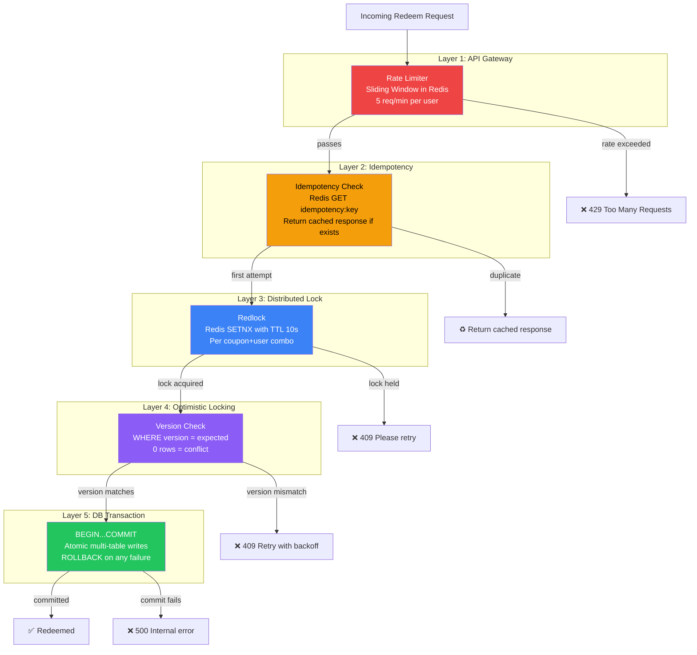

---

### Layer 1: Rate Limiting (API Gateway)

**What it prevents:** Automated scripts, bot attacks, accidental rapid taps

```go
// Sliding window rate limiter using Redis
// Runs at the API Gateway BEFORE the request reaches the Redemption Service

func (rl *RateLimiter) Allow(ctx context.Context, userID string, endpoint string) (bool, error) {
    key := fmt.Sprintf("ratelimit:%s:%s", endpoint, userID)
    now := time.Now().UnixMilli()
    windowStart := now - (60 * 1000) // 1-minute window

    pipe := rl.redis.Pipeline()

    // Remove entries older than the window
    pipe.ZRemRangeByScore(ctx, key, "0", strconv.FormatInt(windowStart, 10))

    // Count current entries in window
    countCmd := pipe.ZCard(ctx, key)

    // Add current request timestamp
    pipe.ZAdd(ctx, key, redis.Z{Score: float64(now), Member: now})

    // Set TTL on the key so it auto-expires
    pipe.Expire(ctx, key, 2*time.Minute)

    _, err := pipe.Exec(ctx)
    if err != nil {
        return true, err // fail-open: allow on Redis error
    }

    count := countCmd.Val()
    limit := rl.getLimitForEndpoint(endpoint)

    return count < int64(limit), nil
}

func (rl *RateLimiter) getLimitForEndpoint(endpoint string) int {
    limits := map[string]int{
        "redeem":   5,  // 5 redemptions per minute per user
        "apply":    10, // 10 apply attempts per minute
        "eligible": 30, // 30 reads per minute
    }
    if l, ok := limits[endpoint]; ok {
        return l
    }
    return 60 // default
}
```

**Why sliding window?** Fixed windows have a boundary problem — a user could send 5 requests at 11:59:59 and 5 more at 12:00:01, effectively 10 requests in 2 seconds. Sliding window counts requests within a rolling 60-second window, preventing this burst.

---

### Layer 2: Idempotency (Duplicate Request Protection)

**What it prevents:** Network retries, double-clicks, load balancer replays

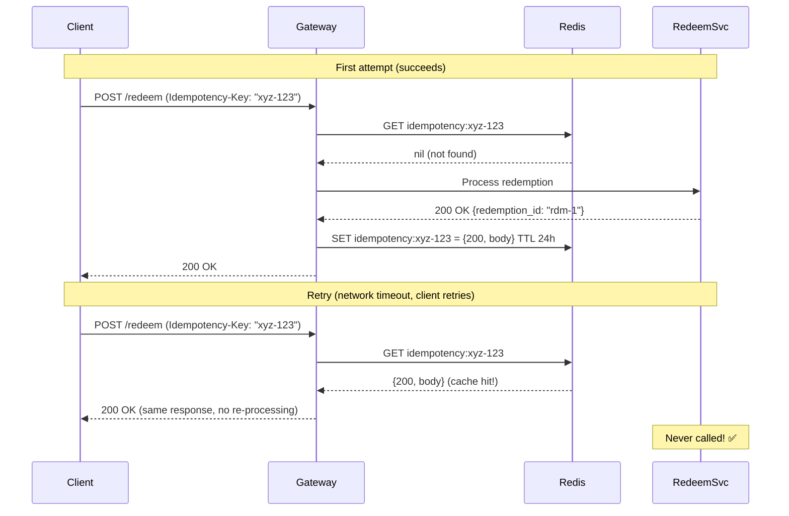

```go
// Idempotency middleware — wraps all mutating endpoints

type IdempotencyMiddleware struct {
    redis *redis.Client
}

type CachedResponse struct {
    StatusCode int    `json:"status_code"`
    Headers    map[string]string `json:"headers"`
    Body       []byte `json:"body"`
}

func (m *IdempotencyMiddleware) Handle(next http.Handler) http.Handler {
    return http.HandlerFunc(func(w http.ResponseWriter, r *http.Request) {
        key := r.Header.Get("Idempotency-Key")
        if key == "" {
            // No idempotency requested — process normally
            next.ServeHTTP(w, r)
            return
        }

        redisKey := fmt.Sprintf("idempotency:%s", key)

        // ── Check for existing response ──
        cached, err := m.redis.Get(r.Context(), redisKey).Bytes()
        if err == nil {
            // Cache hit — return the same response without re-processing
            var resp CachedResponse
            json.Unmarshal(cached, &resp)

            w.Header().Set("X-Idempotent-Replayed", "true")
            for k, v := range resp.Headers {
                w.Header().Set(k, v)
            }
            w.WriteHeader(resp.StatusCode)
            w.Write(resp.Body)
            return
        }

        // ── Acquire processing lock (prevent parallel first attempts) ──
        lockKey := fmt.Sprintf("idempotency-lock:%s", key)
        acquired, err := m.redis.SetNX(r.Context(), lockKey, "1", 30*time.Second).Result()
        if err != nil || !acquired {
            http.Error(w, "Request is being processed", http.StatusConflict)
            return
        }
        defer m.redis.Del(r.Context(), lockKey)

        // ── Process request and capture response ──
        recorder := &responseRecorder{ResponseWriter: w, body: &bytes.Buffer{}}
        next.ServeHTTP(recorder, r)

        // ── Cache the response ──
        resp := CachedResponse{
            StatusCode: recorder.statusCode,
            Body:       recorder.body.Bytes(),
        }
        data, _ := json.Marshal(resp)
        m.redis.Set(r.Context(), redisKey, data, 24*time.Hour)
    })
}
```

---

### Layer 3: Distributed Lock (Redlock)

**What it prevents:** Two goroutines/pods processing the same user+coupon simultaneously

```go
// Redlock implementation for coupon redemption
// Lock is scoped to (coupon_id, user_id) — allows different users to redeem concurrently

type DistributedLock struct {
    redis    *redis.Client
    key      string
    value    string // unique value to ensure only the holder can release
    expiry   time.Duration
}

func (s *redemptionService) acquireLock(ctx context.Context, couponID, userID uuid.UUID) (*DistributedLock, error) {
    lockKey := fmt.Sprintf("coupon:lock:%s:u:%s", couponID, userID)
    lockValue := uuid.New().String() // unique per attempt
    ttl := 10 * time.Second

    // SETNX — only set if key doesn't exist (atomic)
    acquired, err := s.redis.SetNX(ctx, lockKey, lockValue, ttl).Result()
    if err != nil {
        return nil, fmt.Errorf("redis error: %w", err)
    }
    if !acquired {
        return nil, ErrCouponBusy // another request holds the lock
    }

    return &DistributedLock{
        redis: s.redis, key: lockKey, value: lockValue, expiry: ttl,
    }, nil
}

// Release uses a Lua script to atomically check value and delete
// This prevents releasing someone else's lock
func (l *DistributedLock) Release(ctx context.Context) error {
    luaScript := `
        if redis.call("GET", KEYS[1]) == ARGV[1] then
            return redis.call("DEL", KEYS[1])
        else
            return 0
        end
    `
    _, err := l.redis.Eval(ctx, luaScript, []string{l.key}, l.value).Result()
    return err
}
```

**Why Lua script for release?** Without it, this race condition exists:

```
Thread A: GET lock → value matches → (context switch)
Thread B: Lock expires, Thread C acquires lock
Thread A: DEL lock → accidentally deletes Thread C's lock! ❌

With Lua: GET + compare + DEL is atomic → safe ✅
```

**Lock granularity matters:**

| Lock Key Pattern | Granularity | Throughput | Safety |
|---|---|---|---|
| `lock:coupon:{id}` | Per coupon | ❌ Very low — serializes ALL users | Overkill |
| `lock:coupon:{id}:user:{uid}` | Per coupon+user | ✅ High — different users are parallel | ✅ Correct |
| `lock:user:{uid}` | Per user | ⚠️ Medium — blocks all coupon ops for user | Too broad |

We use **per coupon+user** — User A redeeming `SWIGGY50` does NOT block User B redeeming `SWIGGY50`.

---

### Layer 4: Optimistic Locking (Version Column)

**What it prevents:** TOCTOU (Time-Of-Check-To-Time-Of-Use) races WITHIN the database

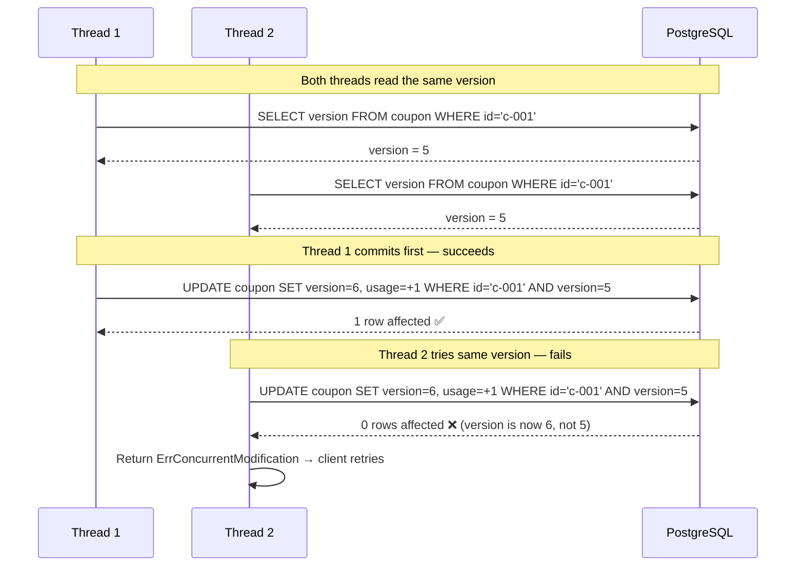

```go
// Optimistic lock check inside the DB transaction

func (r *offerRepo) RedeemWithOptimisticLock(ctx context.Context, tx *sql.Tx, couponID uuid.UUID, expectedVersion int) error {
    result, err := tx.ExecContext(ctx, `
        UPDATE coupon 
        SET current_global_usage = current_global_usage + 1, 
            version = version + 1,
            updated_at = NOW()
        WHERE id = $1 AND version = $2
    `, couponID, expectedVersion)
    if err != nil {
        return fmt.Errorf("update failed: %w", err)
    }

    rowsAffected, _ := result.RowsAffected()
    if rowsAffected == 0 {
        // Another transaction modified this row between our read and write
        return ErrConcurrentModification
    }
    return nil
}
```

**Why not just `SELECT ... FOR UPDATE` (pessimistic locking)?**

| Approach | Pros | Cons |
|---|---|---|
| **Optimistic** (`version` column) | No row locks, higher throughput, better for read-heavy | Must handle retries on conflict |
| **Pessimistic** (`SELECT FOR UPDATE`) | Guaranteed no conflicts | Holds row lock during entire transaction, risk of deadlocks, lower throughput |

For a coupon platform (read-heavy, writes only at checkout), **optimistic locking wins**.

---

### Layer 5: Database Transactions (ACID)

**What it prevents:** Partial writes — e.g., redemption log inserted but usage count not incremented

```go
// The full atomic redemption inside a transaction
// Either ALL three writes succeed, or NONE of them do

func (s *redemptionService) executeRedemption(ctx context.Context, coupon *Coupon, req RedeemRequest) (*CouponRedemptionLog, error) {
    tx, err := s.db.BeginTx(ctx, &sql.TxOptions{
        Isolation: sql.LevelReadCommitted, // prevents dirty reads
    })
    if err != nil {
        return nil, err
    }
    defer tx.Rollback() // no-op if already committed

    // ── Write 1: Bump coupon version + global usage (optimistic lock) ──
    err = s.repo.RedeemWithOptimisticLock(ctx, tx, coupon.ID, coupon.Version)
    if err != nil {
        return nil, err // triggers deferred Rollback
    }

    // ── Write 2: Update user_coupon status + increment usage_count ──
    err = tx.ExecContext(ctx, `
        INSERT INTO user_coupon (user_id, coupon_id, status, usage_count)
        VALUES ($1, $2, 'REDEEMED', 1)
        ON CONFLICT (user_id, coupon_id) DO UPDATE
        SET status = 'REDEEMED',
            usage_count = user_coupon.usage_count + 1,
            redeemed_at = NOW(),
            updated_at = NOW()
    `, req.UserID, coupon.ID)
    if err != nil {
        return nil, err // triggers deferred Rollback
    }

    // ── Write 3: Insert immutable redemption log ──
    redemption := &CouponRedemptionLog{
        ID:             uuid.New(),
        UserID:         req.UserID,
        CouponID:       coupon.ID,
        OrderID:        req.OrderID,
        CouponCode:     coupon.Code,
        CartValue:      req.CartValue,
        DiscountApplied: req.DiscountApplied,
        FinalValue:     req.CartValue - req.DiscountApplied,
        Status:         RedemptionRedeemed,
        IdempotencyKey: &req.IdempotencyKey,
        RedeemedAt:     time.Now(),
    }
    _, err = tx.ExecContext(ctx, `
        INSERT INTO coupon_redemption_log 
        (id, user_id, coupon_id, order_id, coupon_code, cart_value, 
         discount_applied, final_value, status, idempotency_key, redeemed_at)
        VALUES ($1,$2,$3,$4,$5,$6,$7,$8,$9,$10,$11)
    `, redemption.ID, redemption.UserID, redemption.CouponID, 
       redemption.OrderID, redemption.CouponCode, redemption.CartValue,
       redemption.DiscountApplied, redemption.FinalValue, redemption.Status,
       redemption.IdempotencyKey, redemption.RedeemedAt)
    if err != nil {
        return nil, err // triggers deferred Rollback
    }

    // ── All 3 writes succeeded → commit atomically ──
    if err := tx.Commit(); err != nil {
        return nil, err
    }

    return redemption, nil
}
```

---

### Full Redemption Flow — All 5 Layers Combined

```go
func (s *redemptionService) Redeem(ctx context.Context, req RedeemRequest) (*CouponRedemptionLog, error) {
    // ═══ Layer 1: Rate limiting happens at API Gateway (not here) ═══

    // ═══ Layer 2: Idempotency check ═══
    if cached, err := s.checkIdempotency(ctx, req.IdempotencyKey); err == nil {
        return cached, nil // return cached response
    }

    // ═══ Layer 3: Distributed lock ═══
    lock, err := s.acquireLock(ctx, req.CouponID, req.UserID)
    if err != nil {
        return nil, ErrCouponBusy
    }
    defer lock.Release(ctx)

    // ═══ Pre-flight validation (fast checks before hitting DB) ═══
    // Check global limit in Redis (fast, approximate)
    globalKey := fmt.Sprintf("coupon:usage:%s:global", req.CouponID)
    globalCount, _ := s.redis.Get(ctx, globalKey).Int()

    coupon, err := s.repo.GetByID(ctx, req.CouponID)
    if err != nil {
        return nil, ErrCouponNotFound
    }
    if coupon.MaxGlobal != nil && globalCount >= *coupon.MaxGlobal {
        return nil, ErrCouponExhausted
    }

    // Check per-user limit
    userKey := fmt.Sprintf("coupon:usage:%s:u:%s", req.CouponID, req.UserID)
    userCount, _ := s.redis.Get(ctx, userKey).Int()
    if coupon.UsageType == UsageSingleUse && userCount >= 1 {
        return nil, ErrAlreadyUsed
    }
    if coupon.MaxPerUser != nil && userCount >= *coupon.MaxPerUser {
        return nil, ErrUsageLimitExceeded
    }

    // ═══ Layer 4 + 5: Optimistic lock + DB Transaction ═══
    redemption, err := s.executeRedemption(ctx, coupon, req)
    if err != nil {
        if errors.Is(err, ErrConcurrentModification) {
            // Optimistic lock conflict — retry with backoff
            return s.redeemWithRetry(ctx, req, 3)
        }
        return nil, err
    }

    // ═══ Post-commit: Update Redis counters ═══
    s.redis.Incr(ctx, globalKey)
    s.redis.Incr(ctx, userKey)

    // ═══ Store idempotency response ═══
    s.storeIdempotency(ctx, req.IdempotencyKey, redemption)

    return redemption, nil
}
```

---

### Retry Strategy for Optimistic Lock Conflicts

```go
func (s *redemptionService) redeemWithRetry(ctx context.Context, req RedeemRequest, maxRetries int) (*CouponRedemptionLog, error) {
    var lastErr error

    for attempt := 0; attempt < maxRetries; attempt++ {
        // Exponential backoff: 10ms, 40ms, 160ms
        backoff := time.Duration(10*math.Pow(4, float64(attempt))) * time.Millisecond
        jitter := time.Duration(rand.Intn(10)) * time.Millisecond
        time.Sleep(backoff + jitter)

        // Re-read fresh version from DB
        coupon, err := s.repo.GetByID(ctx, req.CouponID)
        if err != nil {
            return nil, err
        }

        redemption, err := s.executeRedemption(ctx, coupon, req)
        if err == nil {
            return redemption, nil // success!
        }

        if errors.Is(err, ErrConcurrentModification) {
            lastErr = err
            continue // retry
        }
        return nil, err // non-retryable error
    }

    return nil, fmt.Errorf("max retries exceeded: %w", lastErr)
}
```

---

### Race Condition Scenario: Flash Sale

**Scenario:** Coupon `NEWYEAR100` has `max_global = 1000`. At midnight, 5,000 users hit "Pay" simultaneously.

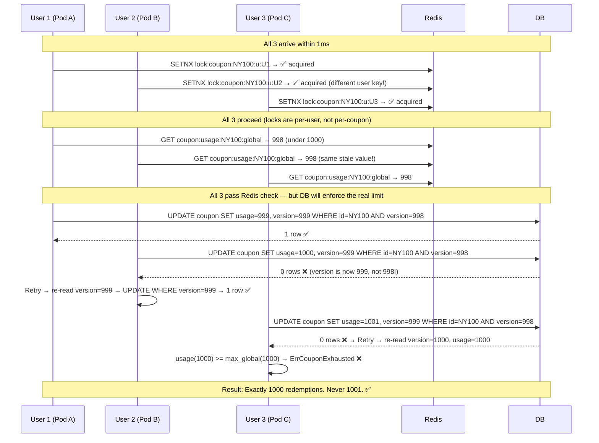

**Key insight:** Redis checks are **approximate** (fast pre-flight). The DB version column is the **source of truth** that prevents over-redemption.

---

### Redis ↔ DB Counter Consistency

Redis counters can drift from DB reality (e.g., if Redis INCR succeeds but response is lost). Here's how we handle it:

```go
// Background reconciliation job — runs every 5 minutes
func (s *reconciler) ReconcileUsageCounters(ctx context.Context) error {
    // Get all active coupons
    coupons, _ := s.repo.GetActiveOffers(ctx)

    for _, coupon := range coupons {
        // Get actual count from DB (source of truth)
        dbCount, _ := s.repo.GetGlobalUsageCount(ctx, coupon.ID)

        // Get Redis counter
        redisKey := fmt.Sprintf("coupon:usage:%s:global", coupon.ID)
        redisCount, _ := s.redis.Get(ctx, redisKey).Int()

        // If they differ, correct Redis
        if redisCount != dbCount {
            log.Warnf("Counter drift detected for coupon %s: redis=%d, db=%d", coupon.ID, redisCount, dbCount)
            s.redis.Set(ctx, redisKey, dbCount, 0)
        }
    }
    return nil
}
```

### Failure Matrix — What Happens When Things Break

| Failure Scenario | Impact | Recovery |
|---|---|---|
| **Redis down entirely** | Rate limiter fails-open, no distributed locks | Fall back to DB-only path: `SELECT FOR UPDATE` (pessimistic locking) |
| **Redis INCR succeeds, DB COMMIT fails** | Counter incremented but no actual redemption | Reconciliation job corrects counter within 5 minutes |
| **DB COMMIT succeeds, Redis INCR fails** | Counter is stale (shows lower usage) | Next reconciliation syncs; or a user might sneak in 1 extra redemption |
| **Distributed lock expires mid-transaction** | Another request could start processing | Optimistic locking (Layer 4) catches this — second request sees stale version |
| **Pod crashes after COMMIT, before response** | Client retries with same idempotency key | Idempotency layer returns cached response from first successful attempt |
| **Kafka event lost (cache not invalidated)** | Stale coupon served for up to 5 min | TTL on Redis cache ensures eventual consistency |

**Concurrency strategy summary:**

| Layer | Mechanism | Protects Against |
|---|---|---|
| **API Gateway** | Rate limiting (sliding window) | Spam / brute force |
| **Redis** | Idempotency key (24h TTL) | Duplicate requests from retries |
| **Redis** | Distributed lock (Redlock, 10s TTL) | Concurrent redeem for same user+coupon |
| **PostgreSQL** | Optimistic locking (`version` column) | TOCTOU race between read and write |
| **PostgreSQL** | DB transaction (`BEGIN...COMMIT`) | Partial writes / dirty state |
| **Background** | Reconciliation job (every 5 min) | Redis ↔ DB counter drift |

---

# Part 3: Database Design

## 3.1 ER Diagram

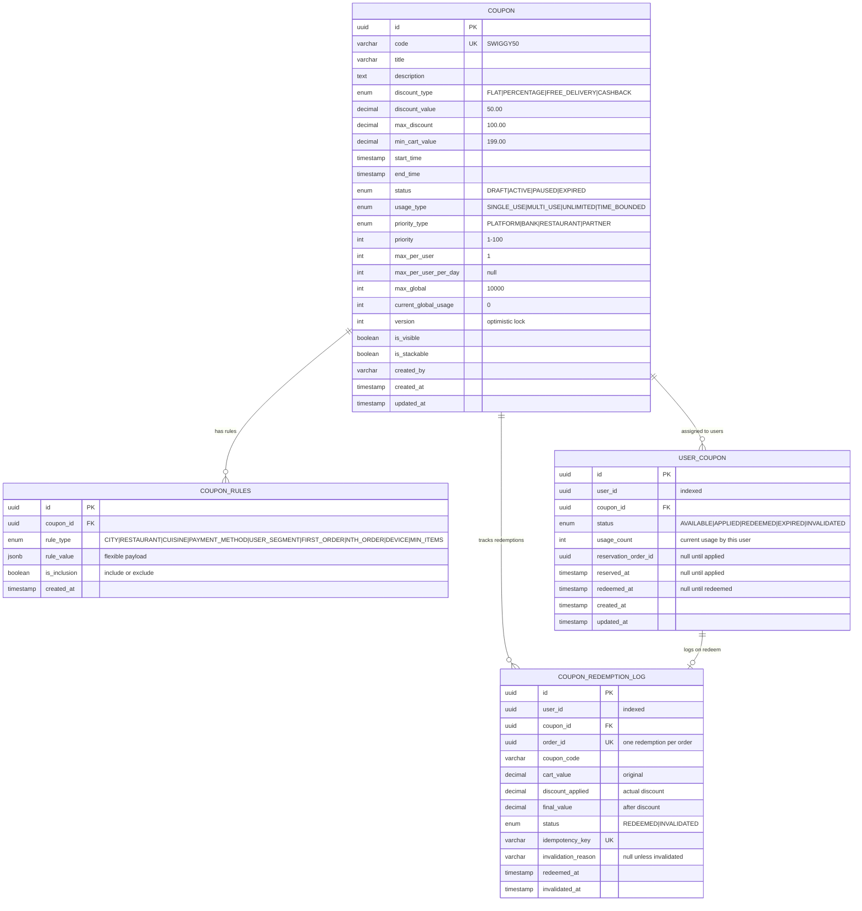

## 3.2 Go Structs (DB Schema in Go)

### Enums

```go
package models

import (
    "database/sql/driver"
    "encoding/json"
    "time"

    "github.com/google/uuid"
)

// ─────────────────── Discount Type ───────────────────
type DiscountType string

const (
    DiscountFlat         DiscountType = "FLAT"
    DiscountPercentage   DiscountType = "PERCENTAGE"
    DiscountFreeDelivery DiscountType = "FREE_DELIVERY"
    DiscountCashback     DiscountType = "CASHBACK"
)

// ─────────────────── Coupon Status ───────────────────
type CouponStatus string

const (
    CouponStatusDraft   CouponStatus = "DRAFT"
    CouponStatusActive  CouponStatus = "ACTIVE"
    CouponStatusPaused  CouponStatus = "PAUSED"
    CouponStatusExpired CouponStatus = "EXPIRED"
)

// ─────────────────── Usage Type ───────────────────
type UsageType string

const (
    UsageSingleUse    UsageType = "SINGLE_USE"
    UsageMultiUse     UsageType = "MULTI_USE"
    UsageUnlimited    UsageType = "UNLIMITED"
    UsageTimeBounded  UsageType = "TIME_BOUNDED"
)

// ─────────────────── Priority Type ───────────────────
type PriorityType string

const (
    PriorityPlatform   PriorityType = "PLATFORM"
    PriorityBank       PriorityType = "BANK"
    PriorityRestaurant PriorityType = "RESTAURANT"
    PriorityPartner    PriorityType = "PARTNER"
)

// ─────────────────── Rule Type ───────────────────
type RuleType string

const (
    RuleCity          RuleType = "CITY"
    RuleRestaurant    RuleType = "RESTAURANT"
    RuleCuisine       RuleType = "CUISINE"
    RulePaymentMethod RuleType = "PAYMENT_METHOD"
    RuleUserSegment   RuleType = "USER_SEGMENT"
    RuleFirstOrder    RuleType = "FIRST_ORDER"
    RuleNthOrder      RuleType = "NTH_ORDER"
    RuleDevice        RuleType = "DEVICE"
    RuleMinItems      RuleType = "MIN_ITEMS"
)

// ─────────────────── User Coupon Status ───────────────────
type UserCouponStatus string

const (
    UserCouponAvailable   UserCouponStatus = "AVAILABLE"
    UserCouponApplied     UserCouponStatus = "APPLIED"
    UserCouponRedeemed    UserCouponStatus = "REDEEMED"
    UserCouponExpired     UserCouponStatus = "EXPIRED"
    UserCouponInvalidated UserCouponStatus = "INVALIDATED"
)

// ─────────────────── Redemption Status ───────────────────
type RedemptionStatus string

const (
    RedemptionRedeemed    RedemptionStatus = "REDEEMED"
    RedemptionInvalidated RedemptionStatus = "INVALIDATED"
)
```

### Table 1: `coupon`

```go
// Coupon represents the core offer definition.
// Maps to the `coupon` table in PostgreSQL.
type Coupon struct {
    ID                 uuid.UUID    `json:"id"                    gorm:"type:uuid;primaryKey;default:gen_random_uuid()"`
    Code               string       `json:"code"                  gorm:"type:varchar(50);uniqueIndex;not null"`
    Title              string       `json:"title"                 gorm:"type:varchar(255);not null"`
    Description        string       `json:"description,omitempty" gorm:"type:text"`
    DiscountType       DiscountType `json:"discount_type"         gorm:"type:varchar(20);not null"`
    DiscountValue      float64      `json:"discount_value"        gorm:"type:decimal(10,2);not null"`
    MaxDiscount        *float64     `json:"max_discount"          gorm:"type:decimal(10,2)"`           // nil for FLAT discounts
    MinCartValue       float64      `json:"min_cart_value"        gorm:"type:decimal(10,2);default:0"`
    StartTime          time.Time    `json:"start_time"            gorm:"type:timestamptz;not null"`
    EndTime            time.Time    `json:"end_time"              gorm:"type:timestamptz;not null"`
    Status             CouponStatus `json:"status"                gorm:"type:varchar(20);not null;default:'DRAFT'"`
    UsageType          UsageType    `json:"usage_type"            gorm:"type:varchar(20);not null;default:'SINGLE_USE'"`
    PriorityType       PriorityType `json:"priority_type"         gorm:"type:varchar(20);not null;default:'PLATFORM'"`
    Priority           int          `json:"priority"              gorm:"default:0"`                     // 0-100, higher = preferred
    MaxPerUser         *int         `json:"max_per_user"          gorm:"column:max_per_user"`           // nil = no per-user cap
    MaxPerUserPerDay   *int         `json:"max_per_user_per_day"  gorm:"column:max_per_user_per_day"`   // nil = no daily cap
    MaxGlobal          *int         `json:"max_global"            gorm:"column:max_global"`             // nil = unlimited
    CurrentGlobalUsage int          `json:"current_global_usage"  gorm:"default:0"`
    Version            int          `json:"version"               gorm:"default:1"`                     // optimistic locking
    IsVisible          bool         `json:"is_visible"            gorm:"default:true"`
    IsStackable        bool         `json:"is_stackable"          gorm:"default:false"`
    CreatedBy          string       `json:"created_by"            gorm:"type:varchar(100)"`
    CreatedAt          time.Time    `json:"created_at"            gorm:"autoCreateTime"`
    UpdatedAt          time.Time    `json:"updated_at"            gorm:"autoUpdateTime"`

    // Associations (loaded via preload, not stored in this table)
    Rules []CouponRule `json:"rules,omitempty" gorm:"foreignKey:CouponID;constraint:OnDelete:CASCADE"`
}

func (Coupon) TableName() string { return "coupon" }

// IsActive checks if the coupon is currently usable.
func (c *Coupon) IsActive(now time.Time) bool {
    return c.Status == CouponStatusActive &&
        now.After(c.StartTime) &&
        now.Before(c.EndTime)
}

// IsGlobalLimitExhausted checks if the coupon has hit its global cap.
func (c *Coupon) IsGlobalLimitExhausted() bool {
    if c.MaxGlobal == nil {
        return false
    }
    return c.CurrentGlobalUsage >= *c.MaxGlobal
}
```

### Table 2: `coupon_rules`

```go
// CouponRule stores flexible eligibility constraints per coupon.
// Maps to the `coupon_rules` table in PostgreSQL.
// rule_value is JSONB — different rule types have different payloads.
type CouponRule struct {
    ID          uuid.UUID       `json:"id"           gorm:"type:uuid;primaryKey;default:gen_random_uuid()"`
    CouponID    uuid.UUID       `json:"coupon_id"    gorm:"type:uuid;index:idx_rules_coupon;not null"`
    RuleType    RuleType        `json:"rule_type"    gorm:"type:varchar(30);not null"`
    RuleValue   json.RawMessage `json:"rule_value"   gorm:"type:jsonb;not null"`  // flexible payload
    IsInclusion bool            `json:"is_inclusion" gorm:"default:true"`          // true=whitelist, false=blacklist
    CreatedAt   time.Time       `json:"created_at"   gorm:"autoCreateTime"`
}

func (CouponRule) TableName() string { return "coupon_rules" }

// ─── Typed rule_value payloads for each RuleType ───

type CityRule struct {
    Cities []string `json:"cities"` // e.g., ["BANGALORE", "MUMBAI"]
}

type RestaurantRule struct {
    RestaurantIDs []string `json:"restaurant_ids"` // e.g., ["rest-1", "rest-2"]
}

type CuisineRule struct {
    Cuisines []string `json:"cuisines"` // e.g., ["BIRYANI", "PIZZA"]
}

type PaymentMethodRule struct {
    Methods []string `json:"methods"` // e.g., ["UPI", "HDFC_CC", "ICICI_DC"]
}

type UserSegmentRule struct {
    Segments []string `json:"segments"` // e.g., ["PREMIUM", "SWIGGY_ONE", "NEW_USER"]
}

type FirstOrderRule struct {
    Required bool `json:"required"` // true = only for first-time users
}

type NthOrderRule struct {
    MinOrders int `json:"min_orders"` // e.g., 5 (unlock after 5th order)
    MaxOrders int `json:"max_orders"` // e.g., 10 (expires after 10th order)
}

type DeviceRule struct {
    Platforms []string `json:"platforms"` // e.g., ["ANDROID", "IOS"]
}

type MinItemsRule struct {
    Count int `json:"count"` // e.g., 2 (minimum items in cart)
}

// ParseCityRule is a helper to unmarshal rule_value for CITY rules.
func (r *CouponRule) ParseCityRule() (*CityRule, error) {
    var rule CityRule
    if err := json.Unmarshal(r.RuleValue, &rule); err != nil {
        return nil, err
    }
    return &rule, nil
}

// ParsePaymentMethodRule is a helper for PAYMENT_METHOD rules.
func (r *CouponRule) ParsePaymentMethodRule() (*PaymentMethodRule, error) {
    var rule PaymentMethodRule
    if err := json.Unmarshal(r.RuleValue, &rule); err != nil {
        return nil, err
    }
    return &rule, nil
}
```

### Table 3: `user_coupon`

```go
// UserCoupon tracks per-user coupon state (applied, redeemed, etc.).
// Maps to the `user_coupon` table in PostgreSQL.
// UNIQUE constraint on (user_id, coupon_id).
type UserCoupon struct {
    ID                 uuid.UUID        `json:"id"                    gorm:"type:uuid;primaryKey;default:gen_random_uuid()"`
    UserID             uuid.UUID        `json:"user_id"               gorm:"type:uuid;index:idx_user_coupon_user;not null"`
    CouponID           uuid.UUID        `json:"coupon_id"             gorm:"type:uuid;not null"`
    Status             UserCouponStatus `json:"status"                gorm:"type:varchar(20);not null;default:'AVAILABLE'"`
    UsageCount         int              `json:"usage_count"           gorm:"default:0"`
    ReservationOrderID *uuid.UUID       `json:"reservation_order_id"  gorm:"type:uuid"`       // set when coupon is applied to a cart
    ReservedAt         *time.Time       `json:"reserved_at,omitempty"`                          // set when applied
    RedeemedAt         *time.Time       `json:"redeemed_at,omitempty"`                          // set when redeemed
    CreatedAt          time.Time        `json:"created_at"            gorm:"autoCreateTime"`
    UpdatedAt          time.Time        `json:"updated_at"            gorm:"autoUpdateTime"`

    // Association
    Coupon Coupon `json:"coupon,omitempty" gorm:"foreignKey:CouponID"`
}

func (UserCoupon) TableName() string { return "user_coupon" }

// CanApply checks if this user-coupon entry allows another application.
func (uc *UserCoupon) CanApply(coupon Coupon) bool {
    switch coupon.UsageType {
    case UsageSingleUse:
        return uc.UsageCount == 0
    case UsageMultiUse:
        if coupon.MaxPerUser == nil {
            return true
        }
        return uc.UsageCount < *coupon.MaxPerUser
    case UsageUnlimited:
        return true
    default:
        return false
    }
}

// MarkApplied transitions the user-coupon to APPLIED state with a reservation.
func (uc *UserCoupon) MarkApplied(orderID uuid.UUID, now time.Time) {
    uc.Status = UserCouponApplied
    uc.ReservationOrderID = &orderID
    uc.ReservedAt = &now
    uc.UpdatedAt = now
}

// MarkRedeemed transitions to REDEEMED and increments usage.
func (uc *UserCoupon) MarkRedeemed(now time.Time) {
    uc.Status = UserCouponRedeemed
    uc.UsageCount++
    uc.RedeemedAt = &now
    uc.UpdatedAt = now
}

// MarkInvalidated rolls back to AVAILABLE on payment failure.
func (uc *UserCoupon) MarkInvalidated(now time.Time) {
    uc.Status = UserCouponAvailable
    uc.ReservationOrderID = nil
    uc.ReservedAt = nil
    uc.UpdatedAt = now
}
```

### Table 4: `coupon_redemption_log`

```go
// CouponRedemptionLog is an immutable audit trail for every redemption attempt.
// Maps to the `coupon_redemption_log` table in PostgreSQL.
// idempotency_key has a UNIQUE constraint to prevent duplicate redemptions.
type CouponRedemptionLog struct {
    ID                  uuid.UUID        `json:"id"                    gorm:"type:uuid;primaryKey;default:gen_random_uuid()"`
    UserID              uuid.UUID        `json:"user_id"               gorm:"type:uuid;index:idx_redemption_user;not null"`
    CouponID            uuid.UUID        `json:"coupon_id"             gorm:"type:uuid;index:idx_redemption_coupon_user;not null"`
    OrderID             uuid.UUID        `json:"order_id"              gorm:"type:uuid;index:idx_redemption_order;not null"`
    CouponCode          string           `json:"coupon_code"           gorm:"type:varchar(50);not null"`
    CartValue           float64          `json:"cart_value"            gorm:"type:decimal(10,2);not null"`
    DiscountApplied     float64          `json:"discount_applied"      gorm:"type:decimal(10,2);not null"`
    FinalValue          float64          `json:"final_value"           gorm:"type:decimal(10,2);not null"`
    Status              RedemptionStatus `json:"status"                gorm:"type:varchar(20);not null;default:'REDEEMED'"`
    IdempotencyKey      *string          `json:"idempotency_key"       gorm:"type:varchar(255);uniqueIndex:idx_redemption_idempotency"`
    InvalidationReason  *string          `json:"invalidation_reason"   gorm:"type:varchar(255)"`
    RedeemedAt          time.Time        `json:"redeemed_at"           gorm:"autoCreateTime"`
    InvalidatedAt       *time.Time       `json:"invalidated_at,omitempty"`
}

func (CouponRedemptionLog) TableName() string { return "coupon_redemption_log" }

// Invalidate marks this redemption as rolled back (e.g., payment failure).
func (log *CouponRedemptionLog) Invalidate(reason string, now time.Time) {
    log.Status = RedemptionInvalidated
    log.InvalidationReason = &reason
    log.InvalidatedAt = &now
}
```

### Cart Context (Request DTO — not a DB table)

```go
// CartContext is the input to the Eligibility Engine.
// Sent by the Cart Service when fetching applicable coupons.
type CartContext struct {
    UserID         uuid.UUID  `json:"user_id"          validate:"required"`
    CartValue      float64    `json:"cart_value"        validate:"required,gt=0"`
    Items          []CartItem `json:"items"             validate:"required,min=1"`
    RestaurantID   string     `json:"restaurant_id"     validate:"required"`
    City           string     `json:"city"              validate:"required"`
    PaymentMethod  string     `json:"payment_method"`
    Platform       string     `json:"platform"`          // ANDROID_APP, IOS_APP, WEB
    UserSegment    string     `json:"user_segment"`      // PREMIUM, SWIGGY_ONE, REGULAR
    UserOrderCount int        `json:"user_order_count"`
    IsNewUser      bool       `json:"is_new_user"`
}

type CartItem struct {
    ItemID   string  `json:"item_id"`
    Name     string  `json:"name"`
    Category string  `json:"category"` // BIRYANI, PIZZA, DESSERT
    Price    float64 `json:"price"`
    Quantity int     `json:"quantity"`
}

// EligibilityResult is the output of the scoring engine for one coupon.
type EligibilityResult struct {
    CouponID           uuid.UUID    `json:"coupon_id"`
    Code               string       `json:"code"`
    Title              string       `json:"title"`
    DiscountType       DiscountType `json:"discount_type"`
    CalculatedDiscount float64      `json:"calculated_discount"`
    PriorityType       PriorityType `json:"priority_type"`
    Score              float64      `json:"score"`
    IsEligible         bool         `json:"is_eligible"`
    FailureReasons     []string     `json:"failure_reasons,omitempty"`
}
```

## 3.3 Table Details (SQL DDL)

### `coupon` — The core offer definition

```sql
CREATE TABLE coupon (
    id                  UUID PRIMARY KEY DEFAULT gen_random_uuid(),
    code                VARCHAR(50) NOT NULL UNIQUE,
    title               VARCHAR(255) NOT NULL,
    description         TEXT,
    discount_type       VARCHAR(20) NOT NULL,  -- FLAT, PERCENTAGE, FREE_DELIVERY, CASHBACK
    discount_value      DECIMAL(10,2) NOT NULL,
    max_discount        DECIMAL(10,2),          -- cap for percentage discounts
    min_cart_value      DECIMAL(10,2) DEFAULT 0,
    start_time          TIMESTAMPTZ NOT NULL,
    end_time            TIMESTAMPTZ NOT NULL,
    status              VARCHAR(20) NOT NULL DEFAULT 'DRAFT',
    usage_type          VARCHAR(20) NOT NULL DEFAULT 'SINGLE_USE',
    priority_type       VARCHAR(20) NOT NULL DEFAULT 'PLATFORM',
    priority            INT DEFAULT 0,         -- 0-100, higher = preferred
    max_per_user        INT,
    max_per_user_per_day INT,
    max_global          INT,
    current_global_usage INT DEFAULT 0,
    version             INT DEFAULT 1,         -- optimistic locking
    is_visible          BOOLEAN DEFAULT true,
    is_stackable        BOOLEAN DEFAULT false,
    created_by          VARCHAR(100),
    created_at          TIMESTAMPTZ DEFAULT NOW(),
    updated_at          TIMESTAMPTZ DEFAULT NOW()
);

CREATE INDEX idx_coupon_status_time ON coupon(status, start_time, end_time);
CREATE INDEX idx_coupon_code ON coupon(code);
CREATE INDEX idx_coupon_priority ON coupon(priority_type, priority DESC);
```

### `coupon_rules` — Flexible constraint rules per coupon

```sql
CREATE TABLE coupon_rules (
    id              UUID PRIMARY KEY DEFAULT gen_random_uuid(),
    coupon_id       UUID NOT NULL REFERENCES coupon(id) ON DELETE CASCADE,
    rule_type       VARCHAR(30) NOT NULL,
    rule_value      JSONB NOT NULL,
    is_inclusion    BOOLEAN DEFAULT true,
    created_at      TIMESTAMPTZ DEFAULT NOW()
);

CREATE INDEX idx_rules_coupon ON coupon_rules(coupon_id);

-- Example rule_value payloads:
-- CITY:           {"cities": ["BANGALORE", "MUMBAI"]}
-- RESTAURANT:     {"restaurant_ids": ["rest-1", "rest-2"]}
-- PAYMENT_METHOD: {"methods": ["UPI", "HDFC_CC"]}
-- FIRST_ORDER:    {"required": true}
-- NTH_ORDER:      {"min_orders": 5, "max_orders": 10}
-- USER_SEGMENT:   {"segments": ["PREMIUM", "SWIGGY_ONE"]}
-- MIN_ITEMS:      {"count": 2}
```

### `user_coupon` — Per-user coupon state tracker

```sql
CREATE TABLE user_coupon (
    id                  UUID PRIMARY KEY DEFAULT gen_random_uuid(),
    user_id             UUID NOT NULL,
    coupon_id           UUID NOT NULL REFERENCES coupon(id),
    status              VARCHAR(20) NOT NULL DEFAULT 'AVAILABLE',
    usage_count         INT DEFAULT 0,
    reservation_order_id UUID,
    reserved_at         TIMESTAMPTZ,
    redeemed_at         TIMESTAMPTZ,
    created_at          TIMESTAMPTZ DEFAULT NOW(),
    updated_at          TIMESTAMPTZ DEFAULT NOW(),
    UNIQUE(user_id, coupon_id)  -- one entry per user per coupon
);

CREATE INDEX idx_user_coupon_user ON user_coupon(user_id);
CREATE INDEX idx_user_coupon_status ON user_coupon(user_id, status);
```

### `coupon_redemption_log` — Immutable audit trail

```sql
CREATE TABLE coupon_redemption_log (
    id                  UUID PRIMARY KEY DEFAULT gen_random_uuid(),
    user_id             UUID NOT NULL,
    coupon_id           UUID NOT NULL REFERENCES coupon(id),
    order_id            UUID NOT NULL,
    coupon_code         VARCHAR(50) NOT NULL,
    cart_value          DECIMAL(10,2) NOT NULL,
    discount_applied    DECIMAL(10,2) NOT NULL,
    final_value         DECIMAL(10,2) NOT NULL,
    status              VARCHAR(20) NOT NULL DEFAULT 'REDEEMED',
    idempotency_key     VARCHAR(255) UNIQUE,    -- prevents duplicate redemptions
    invalidation_reason VARCHAR(255),
    redeemed_at         TIMESTAMPTZ DEFAULT NOW(),
    invalidated_at      TIMESTAMPTZ
);

CREATE INDEX idx_redemption_user ON coupon_redemption_log(user_id);
CREATE INDEX idx_redemption_order ON coupon_redemption_log(order_id);
CREATE INDEX idx_redemption_coupon_user ON coupon_redemption_log(coupon_id, user_id);
CREATE INDEX idx_redemption_idempotency ON coupon_redemption_log(idempotency_key);
```

## 3.3 Atomic Redemption with Optimistic Locking

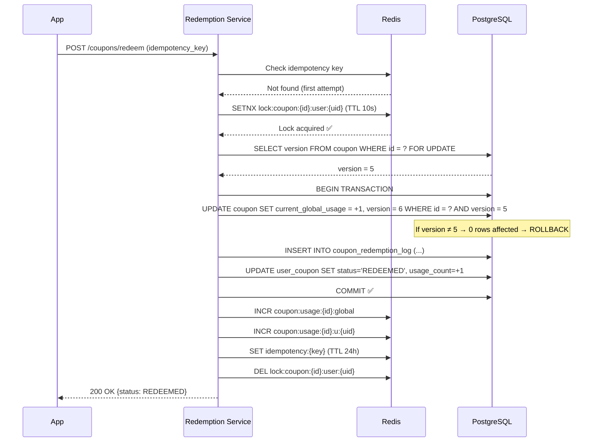

**Why both Redlock AND optimistic locking?**

| Mechanism | Purpose |
|---|---|
| **Redlock** (Redis distributed lock) | Fast-fail for obvious duplicate concurrent requests — avoids hitting DB at all |
| **Optimistic lock** (`version` column) | Catches race conditions within the DB transaction — guaranteed correctness even if Redis lock fails |
| **Idempotency key** | Protects against network retries — same request always returns same response |
