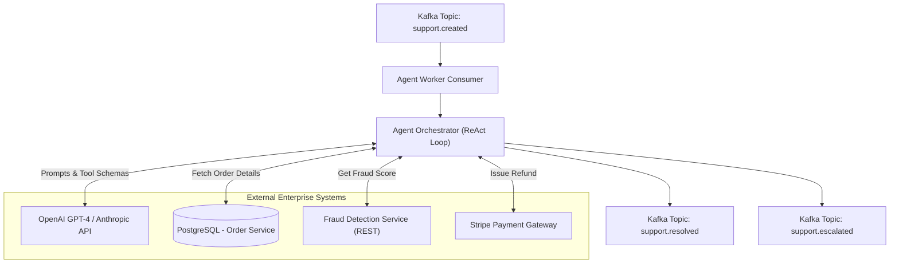

# Production-Grade Autonomous Refund Agent

This document contains the complete system design and production-ready Python codebase framework for deploying an Autonomous Refund Triage Agent.

## 1. High-Level Design (HLD)

In a highly scalable enterprise environment, the Agent acts as a headless worker triggered by messages in a pub/sub system to avoid bottlenecking client HTTP request timeouts.



## 2. Low-Level Design & Guardrails

### OpenAI Tool Calling Specification
The OpenAI API expects tools mapped strictly as JSON Schemas. When the LLM decides memory context warrants the use of a tool, it suspends execution and returns a JSON array detailing `finish_reason=tool_calls`, providing the function name and the structured arguments. 
Our Python Orchestrator script intercepts this, executes the physical local Python API function, appends the result as a `tool_message` back to the memory array context, and prompts the LLM a second time.

### Hardcoded Financial Guardrails
> [!CAUTION] 
> Never rely on an LLM's system prompt string to verify security or authorization limits. They are susceptible to prompt injection attacks. 

- **Physical Tool Limit Checks:** Below, the `issue_refund` tool automatically checks the order's DB value and rejects refunds greater than the maximum authorized threshold natively. The LLM handles the rejection intelligently and can pivot to inform the user why the total refund failed.


## 3. The Full Codebase (Python)

Below is an end-to-end framework. It contains the data mockups, function executions, the exact OpenAI schema configuration, and the loop orchestration.

```python
import json
import os
from typing import Dict, Any, List
# import openai  # In production: pip install openai

# ==========================================
# 1. External DB / Service Adapters
# ==========================================
class OrderDB:
    """Mocking a physical connection to PostgreSQL."""
    @staticmethod
    def get_order(order_id: str) -> dict:
        mock_data = {
            "ORD-001": {"amount": 45.00, "status": "DELIVERED", "delay_mins": 90},
            "ORD-002": {"amount": 12.50, "status": "DELIVERED", "delay_mins": 5}
        }
        return mock_data.get(order_id, {"error": "Order not found"})

class FraudService:
    """Mocking an HTTP call to a Risk Assessment model."""
    @staticmethod
    def check_user(user_id: str) -> dict:
        if user_id == "USER-999": # Known malicious actor simulation
            return {"score": "HIGH_RISK", "blocked": True}
        return {"score": "LOW_RISK", "blocked": False}

class PaymentGateway:
    """Mocking a Stripe SDK execution."""
    @staticmethod
    def refund(order_id: str, amount: float) -> dict:
        return {"status": "SUCCESS", "txn_id": "ch_3Mv_refund_tx"}

# ==========================================
# 2. Tool Wrappers (Execute actual backend APIs)
# ==========================================
def fetch_order_details(order_id: str) -> str:
    """Tool execution: Fetches order metadata based on ID."""
    print(f"[TOOL EXECUTING] >> Querying DB for order: {order_id}...")
    result = OrderDB.get_order(order_id)
    return json.dumps(result)

def check_fraud(user_id: str) -> str:
    """Tool execution: Checks the user's fraud status."""
    print(f"[TOOL EXECUTING] >> Pinging Fraud network for user: {user_id}...")
    result = FraudService.check_user(user_id)
    return json.dumps(result)

def issue_refund(order_id: str, refund_amount: float) -> str:
    """Tool execution: Runs a refund transaction securely."""
    print(f"[TOOL EXECUTING] >> Triggering Gateway... ${refund_amount} for {order_id}")
    
    # ---------------------------------------------
    # CRITICAL: SYSTEM GUARDRAIL (Not LLM reliant logic)
    # ---------------------------------------------
    order_data = OrderDB.get_order(order_id)
    if not order_data or "error" in order_data:
        return json.dumps({"status": "FAILED", "reason": "Invalid order ID specified."})
    
    max_amount = order_data["amount"]
    if refund_amount > max_amount:
         return json.dumps({
             "status": "FAILED", 
             "reason": f"ILLEGAL OPERATION: Requested {refund_amount} exceeds maximum allowed limit {max_amount}"
         })
         
    # Perform transaction safely
    result = PaymentGateway.refund(order_id, refund_amount)
    return json.dumps(result)

# Central routing map
TOOL_EXEC_MAP = {
    "fetch_order_details": fetch_order_details,
    "check_fraud": check_fraud,
    "issue_refund": issue_refund
}

# ==========================================
# 3. Tool JSON Schemas (To feed into the LLM logic)
# ==========================================
OPENAI_TOOLS = [
    {
        "type": "function",
        "function": {
            "name": "fetch_order_details",
            "description": "Fetch chronological delivery timestamps, actual paid amounts, and statuses.",
            "parameters": {
                "type": "object",
                "properties": {"order_id": {"type": "string"}},
                "required": ["order_id"]
            }
        }
    },
    {
        "type": "function",
        "function": {
            "name": "check_fraud",
            "description": "Checks backend to see if a user has a history of refund abuse or high ML fraud flags. Should be used sequentially before executing refunds.",
            "parameters": {
                "type": "object",
                "properties": {"user_id": {"type": "string"}},
                "required": ["user_id"]
            }
        }
    },
    {
        "type": "function",
        "function": {
            "name": "issue_refund",
            "description": "Executes a refund back to a customer's payment origination method.",
            "parameters": {
                "type": "object",
                "properties": {
                    "order_id": {"type": "string"},
                    "refund_amount": {"type": "number"}
                },
                "required": ["order_id", "refund_amount"]
            }
        }
    }
]

# ==========================================
# 4. Agent Execution Orchestrator Loop
# ==========================================
class SupportAgentWorker:
    def __init__(self, api_key: str = "mock-api"):
        # self.client = openai.OpenAI(api_key=api_key)
        pass # Disabling real network requests for demonstration portability
        
    def mock_openai_tool_call(self, history: list) -> list:
        """
        In production, replaces with actual inference:
        response = self.client.chat.completions.create(model="gpt-4o", messages=history, tools=OPENAI_TOOLS)
        return response.choices[0].message
        """
        msg_str = str(history)
        
        # Simulating exact LLM cognitive progression patterns
        if "fetch_order_details" not in msg_str:
            return [{"id": "call_1A", "function": {"name": "fetch_order_details", "arguments": '{"order_id": "ORD-001"}'}}]
            
        elif "check_fraud" not in msg_str:
            return [{"id": "call_2B", "function": {"name": "check_fraud", "arguments": '{"user_id": "USER-123"}'}}]
            
        elif "issue_refund" not in msg_str:
            return [{"id": "call_3C", "function": {"name": "issue_refund", "arguments": '{"order_id": "ORD-001", "refund_amount": 45.0}'}}]
            
        # Agent finally dictates natural language resolving issue
        return "I apologize sincerely for the unprecedented delay. I have fully refunded your order ORD-001 for the physical amount of $45.00."

    def handle_ticket(self, user_id: str, order_id: str, original_ticket_text: str):
        print(f"\n--- INITIATING AGENT TICKET PROTOCOL: {user_id}/{order_id} ---")
        
        # 4A. Setup Initialization
        system_prompt = f"""
        You are an autonomous customer support Agent. 
        Current Context: Ticket created by UserID={user_id}, targeting OrderID={order_id}.
        
        RULES:
        1. Parse the customer's text. If there's a chronological complaint, verify timestamps first.
        2. ALWAYS check fraud history securely before executing any credit transactions.
        3. If delay > 45 minutes and Fraud is strictly `LOW_RISK`, issue a full refund using the exact transactional DB amount.
        4. If Fraud is `HIGH_RISK`, DO NOT REFUND and inform user you escalated it to policy admins.
        """
        
        conversation_history = [
            {"role": "system", "content": system_prompt},
            {"role": "user", "content": original_ticket_text}
        ]
        
        # 4B. The Core Cycle
        max_reasoning_steps = 10
        for step in range(max_reasoning_steps):
            print(f"\n🧠 [Agent Inference Engine - Step {step+1}]")
            
            # --- Inference Request ---
            response_msg = self.mock_openai_tool_call(conversation_history)
            
            # Scenario A: The Model is finished resolving the ticket and returns text.
            if isinstance(response_msg, str): 
                print("\n✅ [RESOLUTION PAYLOAD READY]")
                print(f"Final output: {response_msg}")
                # Emit event to Kafka `support.resolved` topic...
                return {"status": "RESOLVED", "response": response_msg}
                
            # Scenario B: The Model requires physical data processing
            tool_calls = response_msg
            
            # Add the model's desire to use tools explicitly into system memory
            conversation_history.append({"role": "assistant", "tool_calls": tool_calls})
            
            for tool_call in tool_calls:
                func_name = tool_call["function"]["name"]
                arguments = json.loads(tool_call["function"]["arguments"])
                call_id   = tool_call["id"]
                
                # 4C. Physical infrastructure execution overrides
                func_ptr = TOOL_EXEC_MAP[func_name]
                raw_executed_string = func_ptr(**arguments)
                
                # Append the system tool result precisely to the tracking ID
                conversation_history.append({
                    "role": "tool",
                    "tool_call_id": call_id,
                    "name": func_name,
                    "content": raw_executed_string
                })

        return {"status": "ESCALATED", "response": "Recursion limit exceeded."}

# ==========================================
# 5. Kafka Topic Ingestion Simulator
# ==========================================
if __name__ == "__main__":
    
    # Representative of `event = consumer.poll()` from your streaming framework
    KAFKA_EVENT = {
        "user_id": "USER-123",
        "order_id": "ORD-001",
        "text": "My food was practically destroyed and it arrived almost two hours late, give me my money back immediately!"
    }
    
    agent = SupportAgentWorker(api_key=os.getenv("OPENAI_API_KEY"))
    agent.handle_ticket(KAFKA_EVENT["user_id"], KAFKA_EVENT["order_id"], KAFKA_EVENT["text"])
```
