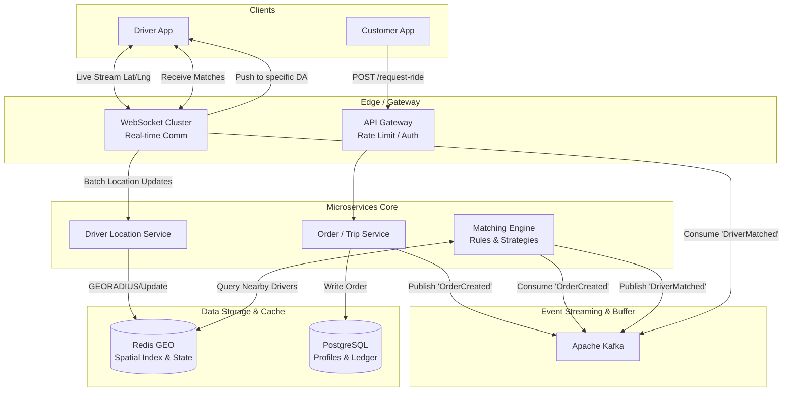

# Driver Assignment & Matching System — High Level Architecture

## 1. End-To-End System Flow

---

## 2. Core Tech Stack Justification

### A. The Engine: **Golang**
We wrote the low-level design in Go for a reason. Matching engines are highly concurrent, computationally heavy, and require tiny latencies. Go’s lightweight goroutines allow the Matching Engine to evaluate thousands of trip requests in parallel without suffering from heavy Garbage Collection pauses like Java or blocking I/O like Node.js.

### B. Spatial Indexing: **Redis GEO (Geohashing) / Uber H3**
Instead of the standard Euclidean distance formula we used in the LLD (which is too slow for millions of rows), we use **Geohashing**.
* **What is Geohashing?** It converts 2D coordinates (Latitude, Longitude) into a 1D string array. If two geohash strings have the same prefix (e.g., `dr5ru` and `dr5rv`), they are physically close to each other constraint boxes.
* **Why Redis?** Redis natively supports `GEOADD` and `GEORADIUS` commands. When the engine needs drivers within 5km, it performs an O(log(N)) memory lookup in Redis rather than scanning a massive Postgres table.
* **Uber H3 alternative:** For massive scale, companies use H3 (Hexagonal hierarchical spatial index), mapping the earth to hexagons for perfectly consistent radius calculations.

### C. Message Broker: **Apache Kafka**
Kafka acts as the nervous system. Matching can fail, drivers can reject trips, and GPS signals can drop.
* **Decoupling:** The Order Service just drops a message `{"topic": "raw_orders", "order_id": 123}` into Kafka. It doesn't need to know *how* or *when* the matching happens.
* **Concurrency:** The Matching Engine cluster reads from Kafka partitions in parallel, offering massive horizontal scalability during "Surge" periods.

### D. Real-Time Communication: **WebSockets**
HTTP Polling (asking the server "Do I have a match yet?" every 2 seconds) would DDoS our servers.
* **Bidirectional:** WebSockets maintain an open, persistent TCP connection with the driver's phone.
* **Action:** The moment the Matching Engine pairs a driver, it fires an event. The WebSocket server pushes that payload instantly to the driver's phone (`Accept or Reject incoming trip`).

---

## 3. Step-by-Step Architecture Flow

### Step 1: Ingesting Live Locations (Continuous)
Drivers are moving constantly. Their app sends `Lat/Lng` packets via WebSockets every 3-5 seconds. 
* The **WebSocket cluster** receives these pings, bats them up, and forwards them to the **Driver Location Service**.
* The Location Service updates **Redis GEO**: `GEOADD driver_locations {longitude} {latitude} {driver_id}`.
* It also updates a regular Redis key for driver state: `SET driver:state:123 "AVAILABLE"`.

### Step 2: The Order is Placed
The user requests a ride.
* The **API Gateway** validates the user's token.
* The **Order Service** safely writes the `PENDING` order into **PostgreSQL**.
* It then publishes an event to **Kafka** on the `orders.created` topic.

### Step 3: The Matching Engine (The Brain)
Instances of the **Matching Engine** are listening to Kafka. An instance picks up the new order.
* **Query Space:** It looks at the order's Lat/Lng. It queries Redis: `GEORADIUS driver_locations {user_lon} {user_lat} 5 km`.
* **State Filter:** Redis returns 50 drivers. The engine immediately checks `driver:state:{id}` to filter out drivers who just accepted a ride and are no longer `AVAILABLE`.
* **Strategy Execution:** Now it runs the exact logic we built in the LLD (Golang code). VIPs get the highest-rated driver from the batch; standard users get the closest.

### Step 4: Dispatch & Offer
The engine has picked `Driver_A`. 
* It writes a soft-lock to Redis: `SETEXT driver_lock_{Driver_A} 15s "LOCKED"`.
* It drops a message in Kafka: `driver.dispatch.offers`.
* The **WebSocket Server**, listening to this topic, finds the TCP socket for `Driver_A` and pushes the payload: `"New Trip: ₹150, 4km away"`.

### Step 5: The Driver Accepts (or Rejects)
* **If Accepted:** Driver app sends `ACCEPT` via WS. System formally assigns order in PostgreSQL. Driver state changes to `ON_TRIP`.
* **If Rejected or Timeout:** Driver sends `DECLINE` (or the 15s lock expires). The WebSocket lets the Matching Engine know. The engine grabs the *second best* driver from its earlier Redis list and loops the process.

---

## 4. Handling High Availability & Failure Scenarios

* **What if the WebSocket Server dies?**
  WebSocket connections are stateful. If physical Server A dies, the drivers connected to it will disconnect. The Driver App contains an auto-reconnect loop that will instantly reconnect them via the Load Balancer to a healthy Server B.
* **What if Redis fails?**
  Redis is heavily relied upon here. Redis runs in a Sentinel/Cluster mode with Master-Slave replication. If a Master node dies, the Slave takes over. At worst, we lose 2-3 seconds of real-time GPS coordinates, which the Driver App simply re-transmits on its next tick.
* **Handling Database Contention (Split Brain):**
  If two orders are generated at the exact same location, both matching engines might try to assign the *same* best driver. We handle this via **Redis Lua Scripts or Distributed Locks** (Redlock), ensuring only one Matching Engine can successfully flip the driver's state from `AVAILABLE` to `LOCKED`.
