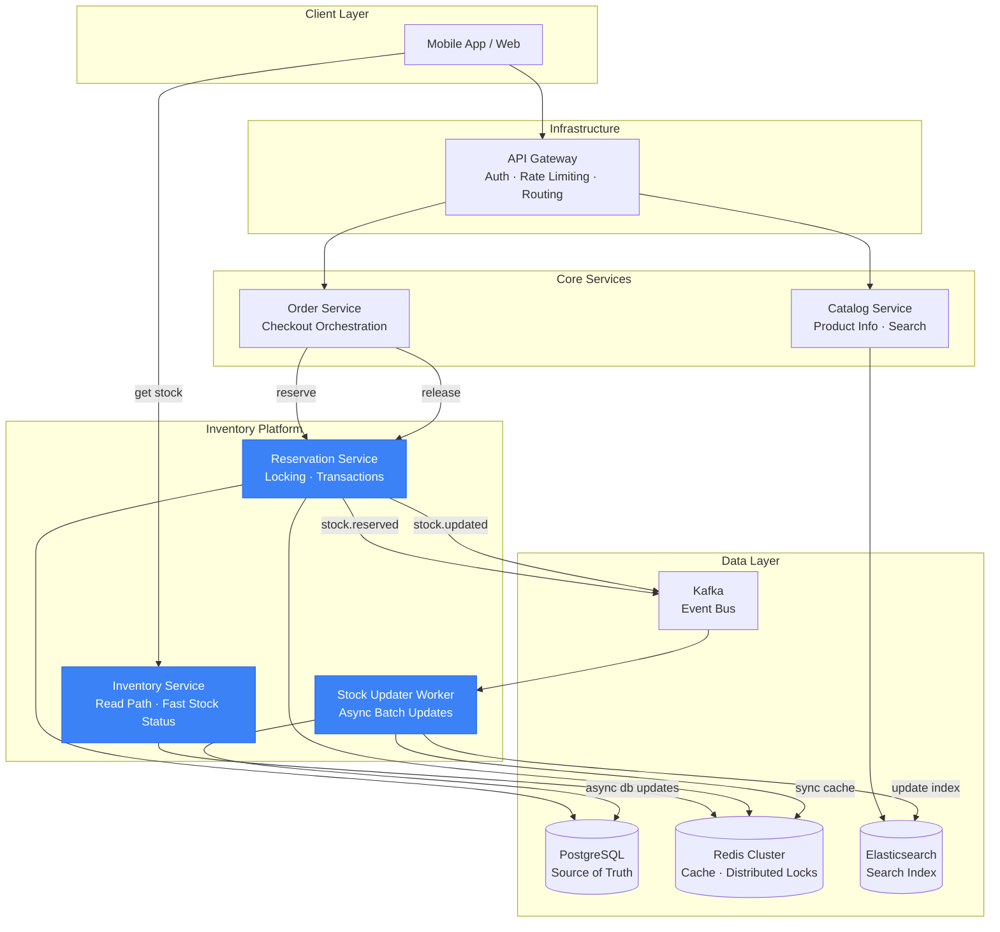
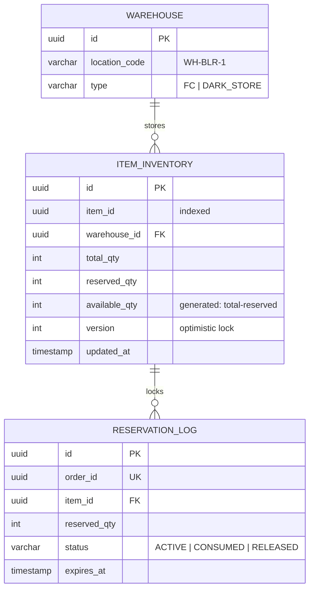

# Inventory Management System — Complete System Design

## End-to-End User Flow

```
User visits product page → GET /inventory/{itemId} (fetch stock for display)
→ User adds to cart → Optionally check stock
→ User initiates checkout → POST /inventory/reserve (lock stock for X mins)
→ Payment Success → POST /inventory/update (deduct stock permanently)
→ Payment Fails / Timeout → POST /inventory/release (unlock stock)
```

---

# Part 1: High-Level Design (HLD)

## 1.1 Microservice Boundaries & Architecture



### 1.2 Event-Driven Architecture using Kafka
- **Decoupling**: The order system shouldn't wait for heavy database aggregations. Instead, `Reservation Service` writes quickly to Redis/DB and emits a `stock.reserved` event.
- **Stock Updater**: Consumes Kafka events to handle async tasks: debouncing repeated UI updates, updating Elasticsearch for "Out of Stock" badges, and persisting slow batch updates to data lakes.

## 1.3 Strong vs Eventual Consistency
| Feature | Consistency Model | Reason |
|---------|-------------------|--------|
| **Checkout/Reservation** | **Strong Consistency** | We **cannot oversell**. If we have 1 iPhone, 2 concurrent users buying must result in 1 success, 1 failure. Handled via CP systems (PostgreSQL locks/Redis Redlock). |
| **Product Detail Page** | **Eventual Consistency** | Showing "Hurry, 2 left" can be slightly stale (delayed by ms/secs). Handled via Redis Cache updated asynchronously. |
| **Search Catalog** | **Eventual Consistency** | Searching for "Shoes" might still show a shoe that went Out of Stock 2 seconds ago. |

## 1.4 Cold-Start Scenarios
During extreme flash sales (e.g., iPhone 15 launch):
- Caches are empty; traffic hits DB directly, bringing it down.
- **Mitigation:**
  - **Predictive Warming:** Scripts pre-load cache for known flash-sale items.
  - **Local Caching:** In-memory caching (e.g., Go `sync.Map` or Ristretto) for 1-2 seconds in the `Inventory Service` to absorb the "thundering herd" before going to Redis.

---

# Part 2: Low-Level Design (LLD) & APIs

## 2.1 API Contracts

### `GET /inventory/{itemId}` — Fetch stock status (Read Path)
Targeting < 10ms P99 latency. Highly cacheable.
```json
// GET /api/v1/inventory/item-123?warehouse_id=wh-01
{
  "item_id": "item-123",
  "warehouse_id": "wh-01",
  "status": "IN_STOCK",
  "available_quantity": 42,
  "last_updated": "2026-04-01T12:00:00Z"
}
```

### `POST /inventory/reserve` — Lock stock for checkout
```json
// POST /api/v1/inventory/reserve
// Headers: Idempotency-Key: "reserve-ord789"
{
  "order_id": "ord-789",
  "user_id": "u-456",
  "items": [
    { "item_id": "item-123", "quantity": 1, "warehouse_id": "wh-01" }
  ]
}

// Response (200 OK)
{
  "status": "RESERVED",
  "reservation_id": "res-999",
  "expires_at": "2026-04-01T12:15:00Z" // 15 min lock
}
```

### `POST /inventory/update` — Permanent deduction after payment
```json
// POST /api/v1/inventory/update
// Headers: Idempotency-Key: "update-res999"
{
  "reservation_id": "res-999",
  "payment_reference": "pay-xyz-123"
}

// Response (200 OK)
{ "status": "DEDUCTED" }
```

### `POST /inventory/release` — Unlock stock (Cancel/Timeout)
```json
// POST /api/v1/inventory/release
{
  "reservation_id": "res-999",
  "reason": "PAYMENT_TIMEOUT"
}

// Response (200 OK)
{ "status": "RELEASED" }
```

## 2.2 Data Modeling 
We abstract inventory into physical and logical locations to easily support multiple Fulfillment Centers (FCs).

```go
type StockState struct {
    TotalQuantity     int // Total physical items in FC
    ReservedQuantity  int // Items currently in people's carts/checkout
    AvailableQuantity int // Total - Reserved. This is what we can sell.
}
```

---

# Part 3: Database Design

## 3.1 ER Diagram



## 3.2 Concurrency Handling: Postgres Level
PostgreSQL schema for the inventory table:
```sql
CREATE TABLE item_inventory (
    id UUID PRIMARY KEY DEFAULT gen_random_uuid(),
    item_id UUID NOT NULL,
    warehouse_id UUID NOT NULL REFERENCES warehouse(id),
    total_qty INT NOT NULL CHECK (total_qty >= 0),
    reserved_qty INT NOT NULL DEFAULT 0 CHECK (reserved_qty >= 0),
    available_qty INT GENERATED ALWAYS AS (total_qty - reserved_qty) STORED,
    version INT DEFAULT 1,
    CONSTRAINT check_available_not_negative CHECK (total_qty - reserved_qty >= 0),
    UNIQUE (item_id, warehouse_id)
);
```
> [!IMPORTANT]
> The `CHECK` constraint at the DB level is the ultimate safeguard against overselling. Even if race conditions bypass application code, the DB will reject the transaction.

---

# Part 4: Technical Deep Dive & Go Code Snippets

## 4.1 Locking Strategies for Reservations

### Strategy 1: Optimistic Locking (For normal traffic)
Fastest, uses `version`. Good for regular items where contention is moderate.

```go
// Go implementation of Optimistic Locking
func ReserveOptimistic(ctx context.Context, itemID string, qty int) error {
    tx, _ := db.BeginTx(ctx, nil)
    defer tx.Rollback()

    // 1. Read current state
    var inv ItemInventory
    err := tx.QueryRow("SELECT reserved_qty, available_qty, version FROM item_inventory WHERE item_id = $1", itemID).
        Scan(&inv.ReservedQty, &inv.AvailableQty, &inv.Version)

    if err != nil {
        return err 
    }

    if inv.AvailableQty < qty {
        return ErrInsufficientStock
    }

    // 2. Try to update, mandating the version hasn't changed!
    res, err := tx.Exec(`
        UPDATE item_inventory 
        SET reserved_qty = reserved_qty + $1, version = version + 1 
        WHERE item_id = $2 AND version = $3`, 
        qty, itemID, inv.Version)
    
    affected, _ := res.RowsAffected()
    if affected == 0 {
        return ErrConcurrentModification // Somebody else bought it; Client should retry
    }

    return tx.Commit()
}
```

### Strategy 2: Pessimistic Locking (For Flash Sales)
Uses `SELECT ... FOR UPDATE`. Better for high contention to avoid high retry rates.

```go
// Go implementation of Pessimistic Locking
func ReservePessimistic(ctx context.Context, itemID string, qty int) error {
    tx, _ := db.BeginTx(ctx, nil)
    defer tx.Rollback()

    // 1. Lock the row exclusively until transaction ends
    var inv ItemInventory
    err := tx.QueryRow(`
        SELECT available_qty FROM item_inventory 
        WHERE item_id = $1 FOR UPDATE NOWAIT`, itemID).Scan(&inv.AvailableQty)
        
    if err == sql.ErrNoRows {
        return ErrItemNotFound
    } else if err != nil { // Could be lock timeout
        return ErrSystemBusy
    }

    if inv.AvailableQty < qty {
        return ErrInsufficientStock
    }

    // 2. Safe to update because we hold the row lock
    _, err = tx.Exec(`UPDATE item_inventory SET reserved_qty = reserved_qty + $1 WHERE item_id = $2`, qty, itemID)
    
    if err != nil {
        return err 
    }
    
    return tx.Commit()
}
```

## 4.2 Redis Cache & Debounce Logic
When 100 people buy an iPhone in one second, updating DB 100 times is heavy. We can:
1. Deduct directly in Redis (Lua Script for strong atomicity).
2. Use a local memory debounce to send a single async update to DB via Kafka (`qty - 100`) after a brief window.

```go
const redisLuaScript = `
local available = tonumber(redis.call('HGET', KEYS[1], 'available_qty'))
local requested = tonumber(ARGV[1])

if available >= requested then
    redis.call('HINCRBY', KEYS[1], 'reserved_qty', requested)
    redis.call('HINCRBY', KEYS[1], 'available_qty', -requested)
    return 1
else
    return 0
end
`

// ReserveInRedis handles ultra-high concurrency reservations directly in memory
func ReserveInRedis(ctx context.Context, itemID string, qty int) bool {
    key := fmt.Sprintf("inventory:%s", itemID)
    res, _ := redisClient.Eval(ctx, redisLuaScript, []string{key}, qty).Result()
    
    if res.(int64) == 1 {
        // Debounce: Emit to high-throughput Kafka topic, worker groups operations 
        // to sync DB later (Eventual consistency for DB writes)
        kafkaProducer.Produce("stock.reserved.fast", itemID, qty)
        return true
    }
    return false
}
```

---

# Part 5: Non-Functional Requirements (NFR)

1. **High Availability (99.99%)**: Redis Cluster for read paths. Multi-AZ Postgres replication. Fallback to slightly stale cache if DB is unreachable.
2. **Low Latency**: 
   - Read API (`GET /inventory/{itemId}`): < 10ms (served from Redis).
   - Write API (`POST /inventory/reserve`): < 50ms (Optimistic locking or Redis Lua).
3. **Scalability**: 
   - Horizontal scaling of read replicas.
   - Hot-key routing in Redis to prevent cluster bottlenecks around flash-sale items.
4. **Idempotency**: Every critical POST uses an `Idempotency-Key` header with Redis 24hr TTL. Upstream retries do not multiply stock deductions.
