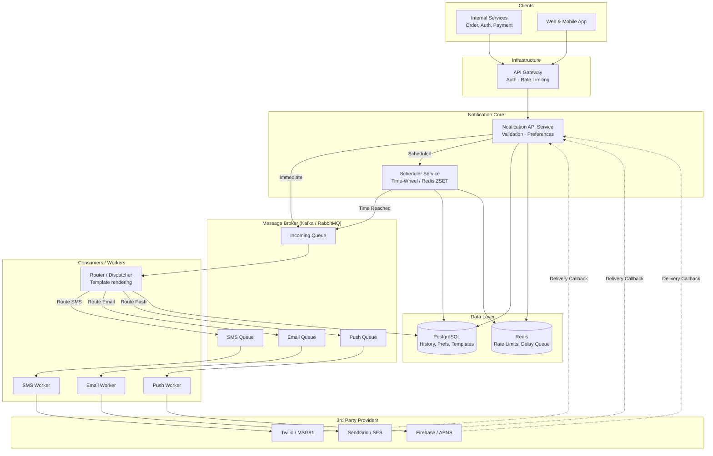

# Notification System Platform — Complete System Design

## End-to-End User Flow

```text
Client/Internal Service 
  → POST /api/v1/notifications/send (Immediate send)
  → POST /api/v1/notifications/schedule (Future send)

Message queued 
  → Notification Router process 
  → Channel-specific queue (SMS / Email / Push)
  → Delivery Worker (e.g., Twilio, SendGrid, FCM)
  → Webhook callback updates DB Status (DELIVERED / FAILED)

User App 
  → GET /api/v1/notifications/history (Fetch inbox / history)
```

---

# Part 1: High-Level Design (HLD)

## 1.1 System Architecture



### Component Responsibilities

| Component | Responsibilities |
|-----------|------------------|
| **API Service** | Receives requests, validates payloads, checks user preferences (opt-ins/outs), and routes to the queue or scheduler. Serves notification history. |
| **Scheduler** | Handles delayed and cron-based notifications. Polls or receives triggers when a scheduled message is due, then pushes it to the main incoming queue. |
| **Router** | Consumes from the incoming queue, fetches the required template from DB, renders the message, and pushes to channel-specific queues. |
| **Workers** | Channel-specific consumers. They manage vendor connection pooling, retries, and rate limits for 3rd-party services. |

---

## 1.2 Asynchronous Processing & Scheduling

Executing scheduled notifications accurately at scale is challenging. A traditional cron job polling a database table (`SELECT * FROM scheduled WHERE trigger_time <= NOW()`) does not scale well past thousands of messages per minute and can cause heavy database locks.

### Optimal Approach: Redis Sorted Sets (Delay Queue)

1. **Schedule Request**: 
   When a request to schedule a notification is received, the message payload is saved to the PostgreSQL `notifications` table with status `SCHEDULED`.
   The `notification_id` is then added to a Redis Sorted Set (ZSET), where the **score** is the UNIX timestamp of the scheduled time.
   
   `ZADD delay_queue <unix_timestamp> <notification_id>`

2. **Scheduler Process (Golang Ticker)**:
   A lightweight background goroutine continually polls Redis for items whose score is `<= now()`.

   ```go
   // Pseudo-code for Redis ZSET polling
   func PollDelayQueue(cache *redis.Client, queueProducer KafkaProducer) {
       ticker := time.NewTicker(1 * time.Second)
       for range ticker.C {
           now := time.Now().Unix()
           // Get items due right now
           items := cache.ZRangeByScore(ctx, "delay_queue", &redis.ZRangeBy{
               Min: "-inf",
               Max: fmt.Sprintf("%d", now),
           }).Val()

           for _, itemID := range items {
               // Push to Kafka
               queueProducer.Publish("incoming_queue", itemID)
               // Remove from ZSET
               cache.ZRem(ctx, "delay_queue", itemID)
           }
       }
   }
   ```

3. **High Availability**:
   If the scheduler node dies, any other node can run the polling since Redis acts as the centralized delay queue. Redis `ZPOPMIN` (with Lua scripts or modern Redis versions) can be used to ensure an atomic fetch-and-delete.

---

# Part 2: Low-Level Design (LLD) & APIs

## 2.1 API Contracts

### `POST /api/v1/notifications/send` (Immediate)
**Request:**
```json
{
  "user_id": "usr_98765",
  "channels": ["EMAIL", "IN_APP"],
  "template_id": "TPL_ORDER_SUCCESS",
  "template_data": {
    "order_id": "ORD-123",
    "amount": "₹499"
  },
  "priority": "HIGH"
}
```
**Response: 202 Accepted**
```json
{
  "message_id": "msg_abc123",
  "status": "QUEUED"
}
```

### `POST /api/v1/notifications/schedule` (Scheduled)
**Request:**
```json
{
  "user_id": "usr_98765",
  "channels": ["SMS"],
  "text": "Your subscription expires in 2 days.",
  "scheduled_time": "2026-04-10T10:00:00Z"
}
```
**Response: 201 Created**
```json
{
  "message_id": "msg_xyz789",
  "status": "SCHEDULED"
}
```

### `GET /api/v1/notifications/history/{user_id}` (History)
**Response: 200 OK**
```json
{
  "items": [
    {
      "message_id": "msg_abc123",
      "channel": "IN_APP",
      "title": "Order Successful!",
      "body": "Your order ORD-123 is confirmed.",
      "status": "DELIVERED",
      "created_at": "2026-04-01T08:00:00Z",
      "read_at": "2026-04-01T08:05:00Z"
    }
  ],
  "next_cursor": "..."
}
```

---

## 2.2 Go Class Design & Design Patterns

We will utilize **Strategy**, **Factory**, and **Builder** patterns to ensure clean, extensible code for multiple notification vendors.

### Design Pattern 1: Strategy Pattern (Sender Selection)

```go
// 1. Common Interface (Strategy)
type NotificationSender interface {
    Send(ctx context.Context, msg NotificationMessage) error
    Supports() string // e.g., "SMS", "EMAIL"
}

// 2. Concrete Implementations
type TwilioSMSSender struct {
    client *twilio.Client
}
func (t *TwilioSMSSender) Send(ctx context.Context, msg NotificationMessage) error {
    // Talk to Twilio API
    return nil
}
func (t *TwilioSMSSender) Supports() string { return "SMS" }


type SendGridEmailSender struct {
    client *sendgrid.Client
}
func (s *SendGridEmailSender) Send(ctx context.Context, msg NotificationMessage) error {
    // Talk to Sendgrid API
    return nil
}
func (s *SendGridEmailSender) Supports() string { return "EMAIL" }

// 3. Factory Pattern
type SenderFactory struct {
    senders map[string]NotificationSender
}

func NewSenderFactory(senders ...NotificationSender) *SenderFactory {
    sf := &SenderFactory{senders: make(map[string]NotificationSender)}
    for _, s := range senders {
        sf.senders[s.Supports()] = s
    }
    return sf
}

func (sf *SenderFactory) GetSender(channel string) (NotificationSender, error) {
    if sender, ok := sf.senders[channel]; ok {
        return sender, nil
    }
    return nil, errors.New("unsupported channel")
}
```

### Design Pattern 2: Builder Pattern (Message Construction)

Constructing complex notification payloads can become messy without a Builder.

```go
type NotificationMessage struct {
    UserID      string
    Title       string
    Body        string
    Channels    []string
    ScheduledAt *time.Time
}

type MessageBuilder struct {
    msg NotificationMessage
}

func NewMessageBuilder() *MessageBuilder {
    return &MessageBuilder{}
}

func (b *MessageBuilder) SetUser(uid string) *MessageBuilder {
    b.msg.UserID = uid
    return b
}

func (b *MessageBuilder) SetContent(title, body string) *MessageBuilder {
    b.msg.Title = title
    b.msg.Body = body
    return b
}

func (b *MessageBuilder) AddChannel(channel string) *MessageBuilder {
    b.msg.Channels = append(b.msg.Channels, channel)
    return b
}

func (b *MessageBuilder) Build() NotificationMessage {
    return b.msg
}

// Usage:
// msg := NewMessageBuilder().SetUser("u123").SetContent("Hello", "World").AddChannel("SMS").Build()
```

---

## 2.3 Database Schema (Golang Structs / GORM)

We use PostgreSQL for strongly typed transactional storage and to maintain a reliable history of notifications.

```go
package models

import (
	"time"
)

type NotificationStatus string
const (
    StatusPending   NotificationStatus = "PENDING"
    StatusScheduled NotificationStatus = "SCHEDULED"
    StatusQueued    NotificationStatus = "QUEUED"
    StatusSent      NotificationStatus = "SENT"
    StatusDelivered NotificationStatus = "DELIVERED"
    StatusFailed    NotificationStatus = "FAILED"
)

type ChannelType string
const (
    ChannelSMS   ChannelType = "SMS"
    ChannelEmail ChannelType = "EMAIL"
    ChannelInApp ChannelType = "IN_APP"
    ChannelPush  ChannelType = "PUSH"
)

// Represents the universal history table for notifications
type Notification struct {
    ID             string             `gorm:"primaryKey;type:uuid;default:uuid_generate_v4()"`
    UserID         string             `gorm:"index"`
    IdempotencyKey string             `gorm:"uniqueIndex"` // Prevent duplicate sends
    Channel        ChannelType        `gorm:"index"`
    Status         NotificationStatus `gorm:"index"`
    
    // Content
    TemplateID     *string
    Title          string
    Body           string             `gorm:"type:text"`
    
    // Metadata/Vendor Info
    ProviderID     string             // e.g., Twilio Message SID for webhooks
    ErrorMessage   *string
    
    // Timing
    ScheduledFor   *time.Time         `gorm:"index"` // Useful for finding delayed tasks
    ReadAt         *time.Time         // For in-app read receipts
    CreatedAt      time.Time          `gorm:"index"`
    UpdatedAt      time.Time
}

// Represents user opt-ins/opt-outs securely
type UserPreference struct {
    UserID        string `gorm:"primaryKey"`
    EmailOptIn    bool   `gorm:"default:true"`
    SMSOptIn      bool   `gorm:"default:true"`
    PushOptIn     bool   `gorm:"default:true"`
    QuietHoursIn  *string // e.g., "22:00"
    QuietHoursOut *string // e.g., "08:00"
    UpdatedAt     time.Time
}

// Represent templates that the Marketing team can tweak without code changes
type Template struct {
    ID          string `gorm:"primaryKey"`
    Name        string 
    Subject     string // For emails
    Body        string `gorm:"type:text"` // Can contain Go html/template vars like {{.Name}}
    ChannelType string 
    CreatedAt   time.Time
}
```

---

## 2.4 Idempotency & Delivery Handling

1. **Idempotency**: Clients must send an `Idempotency-Key` header with immediate `POST /send` requests. The API checks if this key exists in the database. If yes, it skips queuing and returns `200 OK` with the existing `message_id`. This prevents duplicate SMS being sent if the client experiences a network glitch and retries the request.

2. **Delivery Webhooks**: Providers like SendGrid and Twilio provide webhook callbacks on state changes (`delivered`, `bounced`, `spam_report`).
   - The Notification API has endpoints `POST /webhooks/twilio` and `POST /webhooks/sendgrid`.
   - Providers send the `ProviderID` along with status changes.
   - The API updates the PostgreSQL `notifications` table `status` to `DELIVERED` or `FAILED`.

## 2.5 Resiliency and Retries

- If Twilio/SendGrid encounters a **rate limit (429 HTTP)**:
  - The Sender struct (Worker) detects the 429 response.
  - It does **not** mark the message `FAILED`.
  - It pushes the message to a **DLQ (Dead Letter Queue)** or a Kafka `retry_topic` with exponential backoff headers.
  - Alternatively, the worker leaves it unacknowledged so it re-queues.

- If the user prefers **Quiet Hours** (e.g., Do Not Disturb between 10 PM and 8 AM):
  - The Router layer queries `UserPreference`.
  - If `now()` is inside the user's quiet hours, the router pauses the message by inserting it *back* into the Redis Delay Queue with a timestamp for `08:00 AM` the next day.
